# The Coin Game (part 1)

Нам предлагают сыграть в игру, и перед нами даже есть сервер. Нам нужно выиграть 200 монет у казино. Это можно сделать и честно, но нужно сделать несколько попыток. В общем это задание решается просто, написав автоматизированный код, чтобы он сам играл с казино, пока его не выиграет и не получит флаг. Мы же разберём в этом задании почему это вообще возможно и разберём всё с точки зрения теории вероятности и теории игр.

**Теория игры**
Перед нами антагонистическая игра с двумя игроками. Для неё можно составить таблицу выигрышей. Так же в коде можно понять, что противник выбирает 2 с вероятностью 8/13, а 5 соответственно с вероятностью 5/13. Не очевидный выбор стратегии, который сейчас поясним.

**Таблица 1 - таблица выигрышей**
||2 (вероятность 8/13)|5 (вероятность 5/13)|
|---|---|---|		
|2 (вероятность p)|	-2|	3|
|5 (вероятность 1-p)	|3	|-5|

В таблице 1 по горизонтали указан выбор казино и соответствующие вероятности, а по вертикале наши значения с соответствующими вероятностями (p – вероятность, с которой мы выбираем 2), которые пока мы не знаем. Найдём математическое ожидание выигрыша:
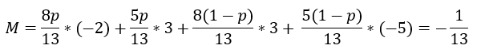
То есть независимо от нашего выбора математическое ожидание будет `-1/13`, другими словами, как бы мы не играли в среднем мы будем терять `-1/13` рублей за ход (конечно, мы то выигрываем, то проигрываем, но в среднем `-1/13`). В теории игр это называется равновесие Нэша. Казино специально выбрало стратегию игры, где мы будем проигрывать, причём оно играет честно и не подглядывает, всё основано на теории вероятности и теории игр. Но средний выигрыш будет стремиться к математическому ожиданию и примерно ему равен, только для большого числа игр. И при малом числе игр можно выиграть. Теперь осталось оценить эту вероятность, чтобы показать, что у нас есть шанс выиграть в игре, где надо выиграть 200 рублей, и даже дадим стратегии чтобы скорее всего выиграть.

**Теория вероятности**
Попытаемся найти формулу вероятности выиграть если у нас на счету n монет, обозначим её `P(n)`, тогда можно составить рекурсивное уравнение и задать граничные условия. Пусть `L` – это изначальное состояние у игрока и казино
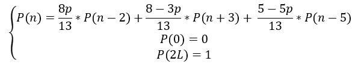

Поясним. Рекурсия работает так, у нас есть три исхода от хода с соответствующими вероятностями. Это исход проиграть `2`, выиграть `3` и проиграть `5`. Фактически мы переходим в другую вероятность при любой ситуации, описываемую той же формулой. Граничные условия, если у нас `0` монет, то мы проиграли и вероятность такого события `0`, если у нас `2L` монет, то мы забрали все деньги у казино и выигрываем с вероятностью `1`.
Теперь вспомним теории рекуррентных соотношений, мы можем найти явную формулу для этой рекурсии, но для этого нужно найти корни характеристического многочлена. 
Который задаётся так:
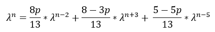
Умножим обе части уравнения на `13` и поделим на `λ^(n-5)`:
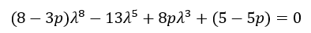
Если найти корни многочлена `r_i`, то формулу можно задать как:
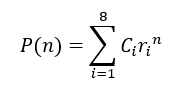
Где `C_i` находятся из граничных условий.

Но нам не нужны все `8 корней`, нам достаточно только найти его вещественные положительные корни. А их на самом деле `2`, один из которых `1`. То есть нам хватит граничных условий для того, чтобы найти константы. Тогда обозначим вещественный корень за `r` и можно составить следующую систему:
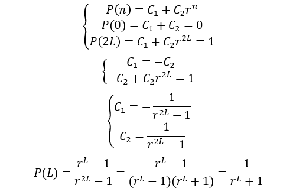
То есть вероятность выиграть если изначальное количество у каждого `L` рублей задаётся формулой выше. Тогда чем меньше `r`, тем лучше. Осталось найти корни характеристического многочлена, но он `8 степени`, а значит для его корней нет формулы и их можно найти только численными методами или графически. Мы найдём их графически и поймём по какой стратегии лучше играть.
`На рисунке 1` изображены графики при разных `p`. Бордовый это при `p = 1`, то есть если всегда выбирать значение `2`. Синий при значении `p = 0`, то есть, когда выбираем только значение `5`. Остальные это промежуточные значения. По графикам видно, что наименьший второй корень при `p = 0` и равен он примерно `1.01` 
Тогда можно сформулировать следующие:
При такой игре лучше всегда выбирать значение `5` и при этом вероятность победы определяется по формуле `P(L)=1/((1.01)^L+1)`. При больших `L` эта вероятность стремиться к `0`, что и следует из теории игр, но при малых есть шанс. Так в нашем случае `P(200)=0.12`, что в общем хорошо и значит просто написав автоматизированную программу, можно хотя бы раз обыграть казино и получить флаг в честной игре.
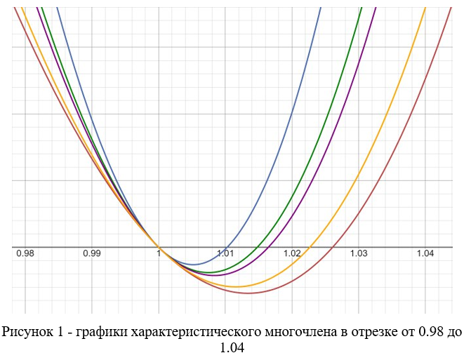


Так же оценим какое среднее количество игр придётся сыграть для того, чтобы выиграть компьютер, для этого найдём математическое ожидание выиграть в нужную игру. Пусть x номер игры, на которой мы выиграли

Таблица 2 - распределение случайной величины
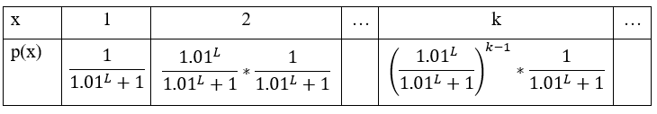
Тогда можно рассчитать математическое ожидание следующим образом:
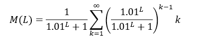
Применим ряд вида 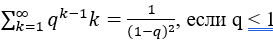, у нас как раз такой случай: 
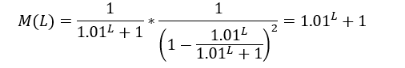
То есть для того, чтобы выиграть в этой игре хотя бы раз у казино придётся сыграть  `M(200)≈9 игр`. Что немного. То есть очень быстро можно обыграть компьютер.
**Итог**
В этом задании можно честно выиграть у казино сыграв примерно `9` игр. При это загадывая только значение `5`. До этого можно было дойти интуитивно, понимая, что `5` он выбирает реже, а значит мы чаше будем выиграть, и есть возможность в начале оторваться до `200 рублей`.

Код программы, которую можно использовать:
```python
import telnetlib
from random import randint

HOST = "10.0.2.15"
PORT = 3680

tn = telnetlib.Telnet(HOST, PORT)

def Test_Ferma(p):
    for _ in range(100):
        a = randint(2, p-2)
        if pow(a, p-1, p) != 1:
            return False
    return True
    
def getPrime(L):
    while True:
        p = randint(1 << L - 1, 1 << L)
        if Test_Ferma(p):
            return p
            
def Signature(a, b, p, x, y):
    return (pow(a, x, p) * pow(b, y, p)) % p

def main():
    tn.read_until(b"\n")
    p = getPrime(1024)
    tn.write(f'{p}'.encode() + b'\n')
    tn.read_until(b"\n")
    tn.read_until(b"\n")
    a = tn.read_until(b"\n")
    a = int(a[4:])
    b = tn.read_until(b"\n")
    b = int(b[4:])
    g = s = 200
    while g > 0 and s > 0:
        g = tn.read_until(b"\n").decode()
        g = int(g[g.index('\t') + 1:])
        s = tn.read_until(b"\n").decode()
        s = int(s[s.index('\t') + 1:])
        tn.read_until(b"\n")
        x = 5
        y = randint(2, p-2)
        sig = Signature(a, b, p, x, y)
        tn.write(f'{sig}'.encode() + b'\n')
        var = tn.read_until(b"\n").decode()
        var = int(var[var.index(':') + 1:])
        tn.read_until(b"\n")
        tn.write(f'{x}'.encode() + b'\n')
        tn.read_until(b"\n")
        tn.write(f'{y}'.encode() + b'\n')
        if var == x:
            s += x
            g -= x
        else:
            s -= 3
            g += 3
    print(tn.read_until(b"\n"))

if __name__ == "__main__":
    main()
```

Запустив программу несколько раз в итоге, получим флаг **RDGCTF{Th3_Nash_3qui1ibrium_s01v3s}**

**Ответ:** RDGCTF{Th3_Nash_3qui1ibrium_s01v3s}