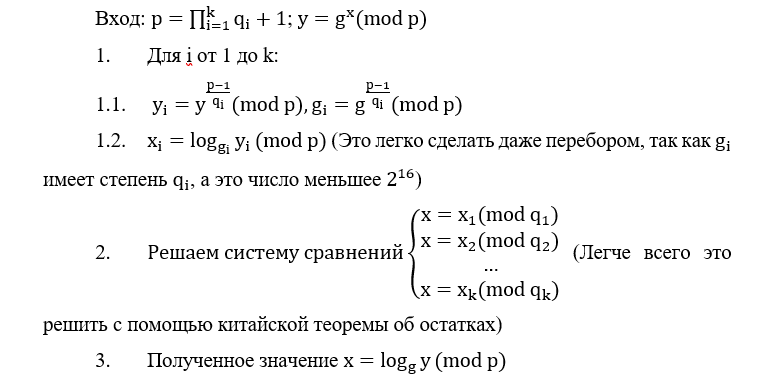

# The Coin Game (part 2)

Это тоже самое что и предыдущее задание. Но теперь у каждого из на `2000 рублей`. Сильно ли поменялась ситуация?! Конечно, потому что все зависимости, посчитанные в предыдущем задании, имели экспоненциальный характер. А конкретно вероятность выиграть в игре `P(2000)≈2,28*10^(-9)` и примерное количество игр, которые надо будет сыграть `M(2000)≈439 286 207`. То есть в отличие от `9` раз как в предыдущем случае придётся сыграть с казино `439 миллиона игр`. При этом надо понимать, что среднее число угадываний с казино примерно равно `13*L=26000`, а на каждое такое действие как минимум казино проделывает `2` операции возведения в степень. Они сами по себе не быстрее, а в нашем случае их придётся проделать примерно `22 триллиона раз`. Другими словами, вы не дождётесь победы в честной игре. Даже по самым простым оценкам на это потребуется `2 года`.
Из этого можно сделать вывод. 
> Придётся играть не честно. 

Теперь посмотрим, что нам мешает это сделать. У нас есть подпись, которая генерируется следующим образом `S(x,y)=α^x β^y (mod p)`, где `p – большое простое число`, которое мы задаём самостоятельно,  `α и β – первообразные члены`, которые выбирает казино, `x – значение монетки или 2 или 5, y – проверочное значение для подписи.` 
Из `S` нельзя получить `x`, так как это односторонняя функция. А значит казино не узнаёт `x`, когда мы отправляем подпись. Нам же, чтобы изменить Наш выбор придётся найти коллизию `S=α^2 β^(y_2 )=α^5 β^(y_5 ) (mod p)`. Для этого можно взять любое значение `y_2, а y_5` найдём, решив задачу дискретного логарифмирования   `β^(y_5 )=Sα^(-5) (mod p)`. Но дискретное логарифмирование это проблема математики и она нерешаема. Если вы так думаете, значит вы плохо учили матчасть по дискретному логарифмированию. Так как при определённых простых числах эта задача легко решаема. К примеру, если число `p` не сильно простое, то разложив `p-1` на маленькие простые множители можно решить задачу `алгоритмом Полига-Хеллмана`. Суть алгоритма в следующем:


Значит мы должны просто подать для казино плохое простое число и найти нужную коллизию, чтобы менять свой выбор монетки, после того как казино озвучило предположение и выигрывать всегда, тогда мы быстро заберём у него `2000 рублей`.
Осталось только сгенерировать плохое простое число. Можно взять, к примеру число:
`p=0x1d65290b673d90c1c4ff309b7ebed2d3f277c9d1799f33219bdc36cbff6e8ce6afc9286e442befdb2e72d0fd2db4b02b785a997f9e70154be933946da2bf0dfd3189a2ccdfc05f5d5709b78701b5ebd23039041d7ed40653b83792f3c5ce592a80b3318ffad786e74e69aea06e27d4f9ce96a9ce0973b5160c961e62d7c8681a87`
Каждый делитель `p-1 меньше 2^16`

Код можно реализовать следующим образом:
```python
import telnetlib
from random import randint

HOST = "10.0.2.15"
PORT = 3680

tn = telnetlib.Telnet(HOST, PORT)

def KTO(A, M):
    Mod = 1
    for m in M:
        Mod *= m
    x = 0
    for i in range(len(A)):
        m = Mod // M[i]
        x += A[i] * m * pow(m, -1, M[i])
    return x % Mod

def log(a, g, q, p):
    b = pow(g, (p - 1) // q, p)
    for k in range(q):
        if pow(b, k, p) == a:
            return k
    return None

def log_discret(y, g, Q, p):
    K = [log(pow(y, (p - 1) // i, p), g, i, p) for i in Q]
    return KTO(K, Q)    
            
def Signature(a, b, p, x, y):
    return (pow(a, x, p) * pow(b, y, p)) % p

def main():
    p = 0x1d65290b673d90c1c4ff309b7ebed2d3f277c9d1799f33219bdc36cbff6e8ce6afc9286e442befdb2e72d0fd2db4b02b785a997f9e70154be933946da2bf0dfd3189a2ccdfc05f5d5709b78701b5ebd23039041d7ed40653b83792f3c5ce592a80b3318ffad786e74e69aea06e27d4f9ce96a9ce0973b5160c961e62d7c8681a87
    Q = [i for i in range(2, 2**16) if (p - 1) % i == 0]
    tn.read_until(b"\n")
    tn.write(f'{p}'.encode() + b'\n')
    tn.read_until(b"\n")
    tn.read_until(b"\n")
    a = tn.read_until(b"\n")
    a = int(a[4:])
    b = tn.read_until(b"\n")
    b = int(b[4:])
    y2 = 1
    sig = Signature(a, b, p, 2, y2)
    y5 = log_discret((sig * pow(a, -5, p)) % p, b, Q, p)
    g = s = 2000
    while g > 0 and s > 0:
        g = tn.read_until(b"\n").decode()
        g = int(g[g.index('\t') + 1:])
        s = tn.read_until(b"\n").decode()
        s = int(s[s.index('\t') + 1:])
        tn.read_until(b"\n")
        tn.write(f'{sig}'.encode() + b'\n')
        var = tn.read_until(b"\n").decode()
        var = int(var[var.index(':') + 1:])
        tn.read_until(b"\n")
        if var == 2:
            x, y = 5, y5
        else:
            x, y = 2, y2
        tn.write(f'{x}'.encode() + b'\n')
        tn.read_until(b"\n")
        tn.write(f'{y}'.encode() + b'\n')
        if var == x:
            s += x
            g -= x
        else:
            s -= 3
            g += 3
    print(tn.read_until(b"\n"))

if __name__ == "__main__":
    main()
```

Выиграв, получим флаг **RDGCTF{H0w_d1d_y0u_gu3ss_3v3ryth1ng}**

**Ответ:** RDGCTF{H0w_d1d_y0u_gu3ss_3v3ryth1ng}
