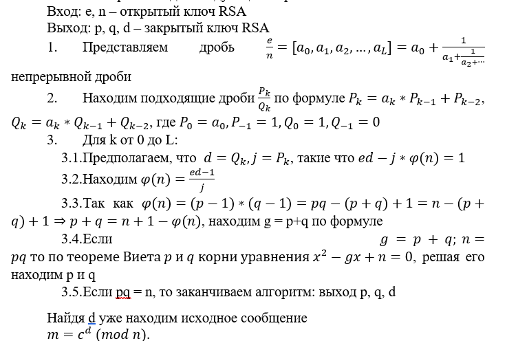

# RSA

Конечно, это известная `атака` `Винера`, причина по которой нельзя путать e и d. Вообще эта атака работает, если `d<∜n/4`, в данном случае так и выходит, значит можно использовать эту атаку.
`Атака Винера` выглядит следующим образом:


Код программы на языке python ниже:
```python
from Cryptodome.Util.number import long_to_bytes

def Drob(a, b):
    A = []
    while b != 0:
        q, r = a // b, a % b
        A.append(q)
        a, b = b, r
    return A

def P_Q(A):
    P = [A[0], A[1]*A[0] + 1] + [0]*(len(A)-2)
    Q = [1, A[1]] + [0]*(len(A)-2)
    for i in range(2, len(A)):
        P[i] = A[i]*P[i-1] + P[i-2]
        Q[i] = A[i]*Q[i-1] + Q[i-2]
    return P, Q

def sqrt_D(D):
    N, V = 0, D
    a = D
    while a**2 != D:
        a = (N + V) // 2
        if a**2 > D:
            V = a
        else:
            N = a
        if V - N <= 1:
            break
    return a

def Winer(e, n):
    P, Q = P_Q(Drob(e, n))
    for i in range(len(P)):
        k = P[i]
        d = Q[i]
        if k !=0 and (e*d - 1) % k == 0:
            fi = (e*d - 1) // k
            p_q = n + 1 - fi
            D = (p_q)**2 - 4*n
            D = sqrt_D(D)
            p = (p_q + D) // 2
            q = (p_q - D) // 2
            if p*q == n:
                break
    return p, q, d

def main():
    c = 24899103…1920138718590977666705424243076113050819974410850661847868
    n = 18069437…8640862051861970207406693189974708367870701210390096594271
    e = 15051917…7111970866954186916201619001618269738338075951940739246155
    p, q, d = Winer(e, n)
    flag = long_to_bytes(pow(c, d, n))
    print(flag)

if __name__ == "__main__":
    main()
```

**Ответ:** RDGCTF{Wiener_attack_how_easy_it_is_to_make_a_mistake}
