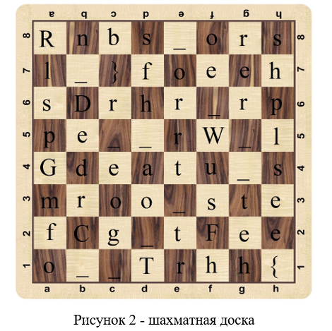
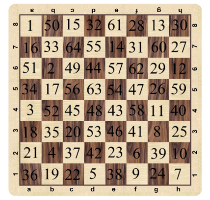

# Horse running

Перед нами шахматная доска и тут расшифровании происходит по принципу полному ходу коня. Нахождение пути полного хода коня – это известная задача в ходе которого находится путь, по которому пройдёт конь, пройдя все клетки, но нигде не побывав дважды. Данную задачу можно решить и визуально подбирая варианты исходя из возможных ходов коня. При этом мы знаем, что путь начинается с левого верхнего угла, так как там буква `R`. И она одна, а это начало флага, тогда даже часть пути коня мы уже знаем и так далее, подбирая осмысленные слова. 



Но эту задачу можно решить и математически, используя метод поиска пути пользуясь правилом Варнсдорфа. Это жадный алгоритм, который ищет путь каждый раз выбирая клетку, из которой меньше всего вариантов походить дальше. 
Тогда можно написать следующий код решения:

```python
def num_var(x, y, A):
    res = 0
    for k in range(2):
        for i in range(2):
            for j in range(2):
                a = x + (2 - k) * (-1)**i
                b = y + (1 + k) * (-1)**j
                if 0 <= a <= 7 and 0 <= b <= 7 and A[a][b] == 0:
                    res += 1
    return res

def next_xy(x, y, A):
    x1, y1, n = 8, 8, 9
    for k in range(2):
        for i in range(2):
            for j in range(2):
                a = x + (2 - k) * (-1)**i
                b = y + (1 + k) * (-1)**j
                if 0 <= a <= 7 and 0 <= b <= 7 and A[a][b] == 0:
                    r = num_var(a, b, A)
                    if r < n:
                        x1, y1, n = a, b, r 
    return x1, y1, n

def main():
    with open('cipher.txt', 'r') as file:
        cipher = file.readlines()
    flag = 'R'
    A = [[0] * 8 for _ in range(8)]
    i, j = 0, 0
    A[i][j] = 1
    for k in range(2, 65):
        i, j, n = next_xy(i, j, A)
        if n == 9:
            break
        else:
            A[i][j] = k
            flag += cipher[i][j]
    print(flag)

if __name__ == "__main__":
    main()
```

В итоге получаем следующий порядок хода коня:


**Ответ:** RDGCTF{the_problem_of_the_horses_progress_the_Warnsdorf_rule___}