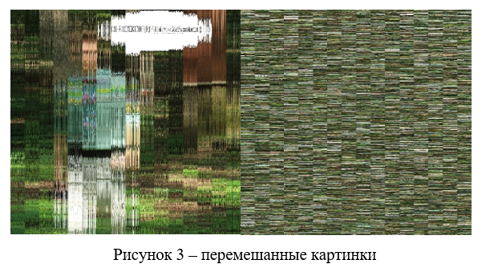
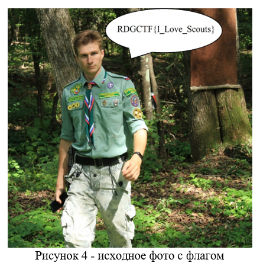

# Permutation

Здесь мы видим, что у нас два вида перестановки. По горизонтали и вертикале. Как видим по горизонтали переставляются `109` элементов, а по вертикале целых `27216`. Переставляются только пиксели, заголовок файла остаётся неизменным при шифровании. В итоге перед нами две картинки.



Конечно, по вертикальной перестановке вообще не видно никаких очертаний, а по горизонтальной мы видим, что на ней написан флаг, а значит нужно переставить всё обратно и вернуть картинку, а на ней прочитать флаг.
Так как видно, что это реальное фото, а значит у него будет уникальный набор пикселей. Это нам поможет не вычислять статистики, а однозначно всё вернуть на место. При перестановке по вертикале никак не меняется сочетание пикселей между столбцами, а значит мы сможем узнать какие пары пикселей есть при соединении 1 и 2 столбца, и сколько таких пар. Аналогично при соединении 2 и 3 и т. д.
Собрав данные о сочетании столбцов, останется только вычислить как должны стоять столбцы при горизонтальной перестановке. Для это берём первый столбец и совмещаем его со вторым, считаем количество сочетаний пикселей. Если такой набор сочетаний есть при подсчётах по вертикали, то значит такие столбцы могут стоять рядом, и мы даже знаем где они должны стоять. Если такого набора нет, то мы к первому подставляем 3 столбец и т. д. Потом переходи к подстановке ко второму столбцу. В итоге переставляем столбцы по полученному ключу и получаем исходное фото (рисунок 4).
Итог: использовать надо или горизонтальную или вертикальную перестановку, или обе одновременно. И отметим, что если бы не дали вертикальной перестановке, то всё равно можно было бы вернуть всё на место, но при этом нужно было иметь примерную статистику сочетания пикселей и сравнить по статистике хи квадрат. Или использовать метод запрещённых биграмм. Проблема, что с пикселями в общем случае могут быть любые сочетания. 



Можно это сделать по следующему коду:

```python
def main():
    L = 109
    with open('cipherV.bmp', 'rb') as file:
        text = file.read()
    n = int.from_bytes(text[10:14], byteorder = "little")

    text_pixel = [text[i: i+3] for i in range(n, len(text), 3)]
    len_pixel = len(text_pixel)

    text_table = [[text_pixel[i + j] for j in range(0, len_pixel, L)] for i in range(L)]
    text_table_stat = [sorted([text_table[i][j] + text_table[i+1][j] for j in range(len(text_table[0]))]) for i in range(L - 1)]

    print(len(text_table[0]))
    with open('cipherG.bmp', 'rb') as file:
        text = file.read()
    n = int.from_bytes(text[10:14], byteorder = "little")

    text_pixel = [text[i: i+3] for i in range(n, len(text), 3)]
    len_pixel = len(text_pixel)
    text_table = [[text_pixel[i + j] for j in range(0, len_pixel, L)] for i in range(L)]

    key = [-1] * 109
    for i in range(L):
        print(i)
        for j in range(L):
            if i == j:
                continue
            stat = sorted([text_table[i][k] + text_table[j][k] for k in range(len(text_table[0]))])
            if stat in text_table_stat:
                key[text_table_stat.index(stat)] = i
                key[text_table_stat.index(stat) + 1] = j
                break
            
    cipher = text[:n]
    cipher_table = [text_table[k] for k in key]
    c = b''.join([b''.join([cipher_table[i][j] for i in range(L)]) for j in range(len(text_table[0]))])
    cipher += c
    with open('flag.bmp', 'wb') as file:
        file.write(cipher)
            

if __name__ == "__main__":
    main()
```

**Ответ:** RDGCTF{I_Love_Scouts}
