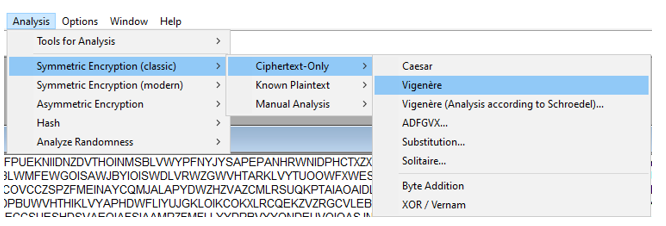

# Classic

Открываем зашифрованный файл и видим, что он очень большой. Единственное, что можно делать в случае, если известен только шифртекст (особенно если он большой) – это пробивать его на статистику, так как могли остаться особенности начального осмысленного текста. Для этого лучше всего подходит бесплатная программа **CrypTool**, которую можно скачать по ссылке: https://www.cryptool.org/en/ct1/downloads. 

Внимательно просмотрев текст, можем заметить, что тут присутствуют только осмысленные символы. Из чего можно сделать вывод, что это был шифр, работающий с символами. К таковым относятся: Перестановка, Шифр простой замены, Шифр Виженера, Шифр Цезаря и т. д. Попробовать можно любой. Единственное можно сразу отсечь перестановку, так как скобки для флага стоят на своём месте в начале. Вообще это шифр Виженера. Пробиваем его на статистику (рисунок 5).

 
Рисунок 5 - выбор анализа шифра Виженера

Запустив анализ, видим следующую картину (рисунок 6):
 
Рисунок 6 - статистика согласия хи-квадрат

Из этого можно сделать однозначный вывод, что длина ключа была 30 символов. Так как на каждые 30 символов приходит резкий скачок статистики. Выбираем подбор возможного ключа и смотрим, что получилось (рисунок 7):

 
Рисунок 7 - расшифрованный текст

Видим, что мы получили осмысленный текст (это часть произведения «Шерлок Холмс»). В начале наблюдаем флаг. 

**Ответ:** RDGCTF{WHATISCTFWITHOUTTHESETASKS}
