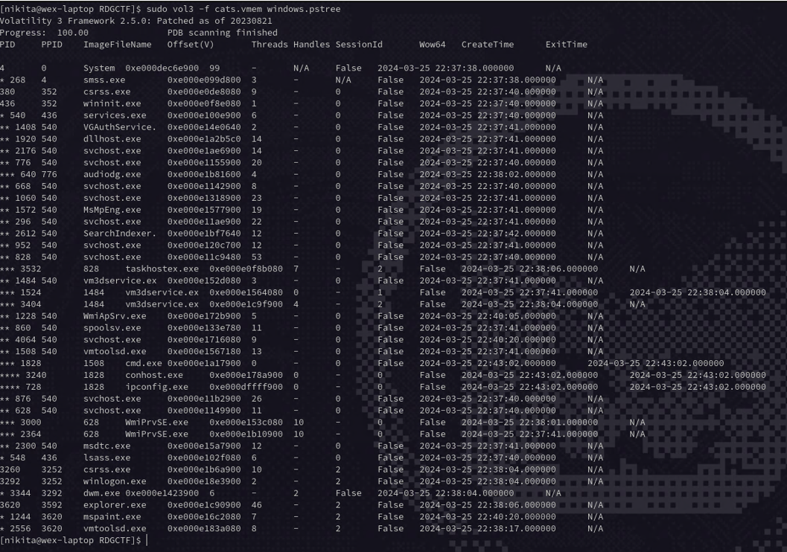
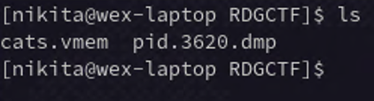
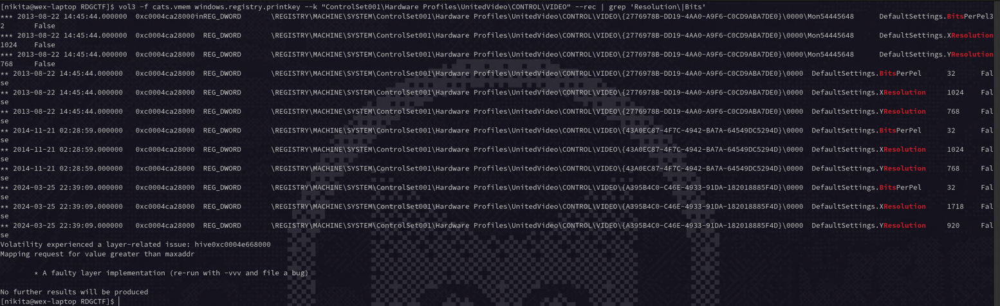
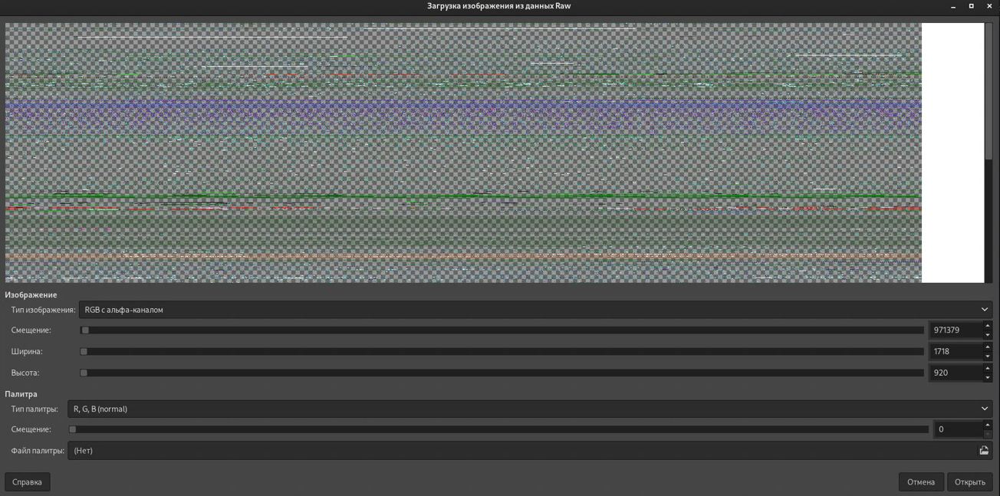
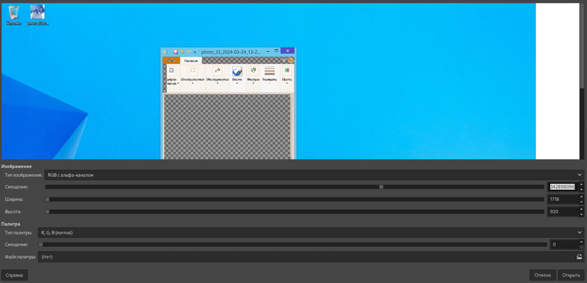
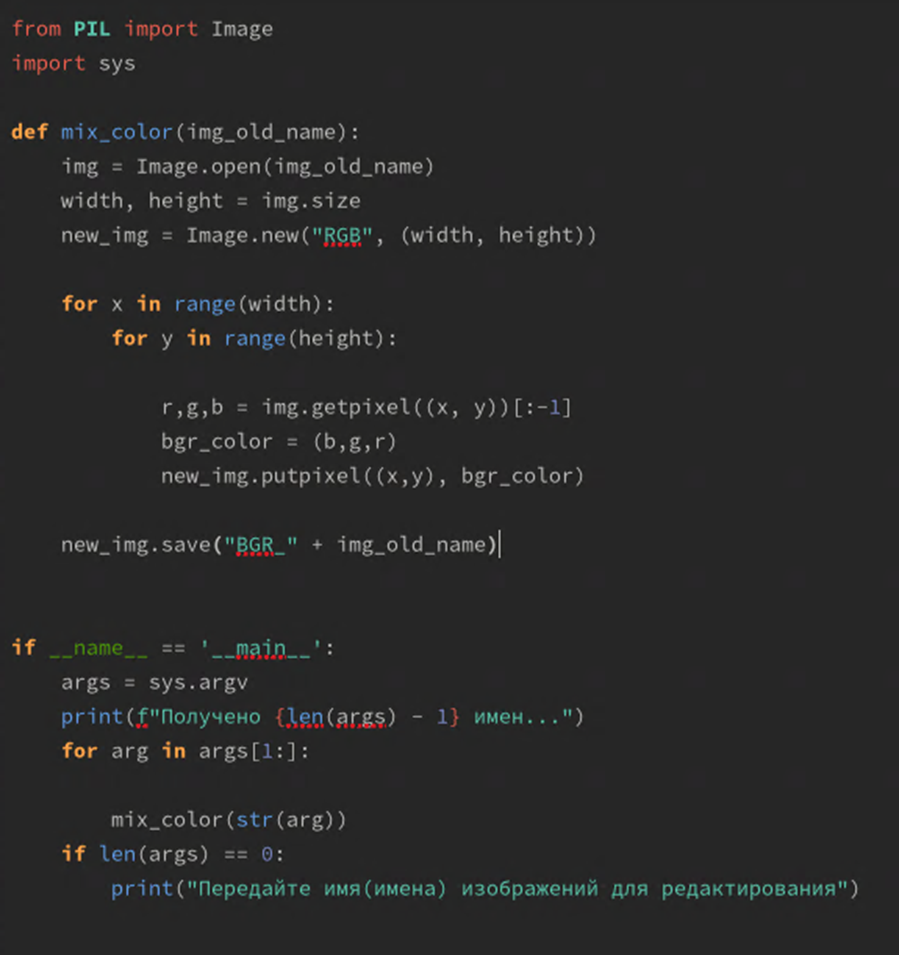
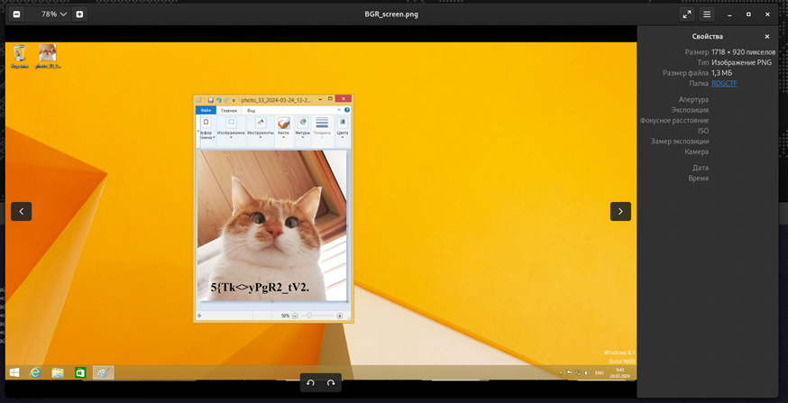

# CATSSSSSS

Имеем дамп файла windows 8.1 и заблокированный архив. Используя утилиту volatility, смотрим процессы для последующего дампа

```bash
sudo vol3 -f cats.vmem windows.pstree
```



Находим процесс, который использует **GUI**, например **explorer.exe**

Дампим процесс, используя **PID** процесса 

```bash
vol3 -f cats.vmem windows.memmap --dump --pid 3644
```



Наша цель, найти в дампе памяти процесса explorer.exe искомую картинку на экране. Для полноценного восстановления картинки, необходимо знать настоящее разрешение экрана. Для этого берет его из реестра.

```bash 
vol3 -f cats.vmem windows.registry.printkey --k "ControlSet001\Hardware Profiles\UnitedVideo\CONTROL\VIDEO" --rec | grep 'Resolution\|Bits'
```

Реестр винды хранит все разрешения экранов, которые были от начала создания, и все последующие изменения. Разрешение **1024x768** – стандартное при создании. Поэтому используем последнее паоставленное разрешение. Последнее разрешение **1718x920** **и цветность (бит/пиксель) 32**.

Восстанавливает картинку. Для открытия дампа в редакторе, добавляем расширение data. После открытия файла выставляем высоту и ширину экрана. И тип пикселя **RGB-с альфа каналом**. 


Изменяем смещения до тех пор, пока не будет видна полупрозрачная картинка нашего экрана(**342898096**). Это нужно для полного восстановления исходной картинки.



В **Windows** элементы интерфейса, пиксели хранятся с перевернутым порядком байт, поэтому **RGB** лежит в памяти как **BGR**. Сохраняем нашу картинку и восстанавливаем цвета для получения искомой картинки. Необходимо изменить **BGR** в **RGB**, можно делать в графическом редакторе либо используя скрипты для изменения местами **R** и **B**.

После запуска скрипта видим настоящий скриншот экрана

Открываем рарник при помощи пароля и получаем флаг **RDGCTF{Y0U_F1ND_M3_4ND_MY_C4T’S}**