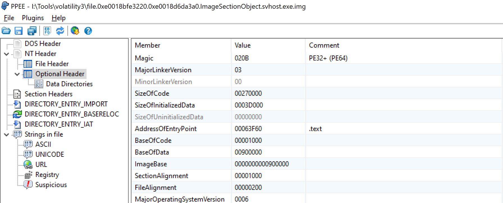

# Первоначальный доступ

### Задание

*В ходе целевой хакерской атаки корпоративная сеть организации была скомпрометирована. 
Проведите анализ предоставленных материалов и восстановите хронологию инцидента.* 
 
Наиболее вероятной точкой проникновения злоумышленником стала рабочая станция сотрудника отдела кадров организации. 
Наши специалисты сделали копию электронных писем указанного сотрудника за последние несколько дней для подтверждения 
данной гипотезы. Определите адрес электронной почты злоумышленника. Формат флага: RDGCTF{email}
 
Ссылка на вложение: https://disk.yandex.ru/d/_sb4N-FQdV0GeA

### Решение

Содержимое архива представляет собой набор электронных писем в формате EML. Для удобного просмотра можно воспользоваться
одним из популярных почтовых клиентов (например, Thunderbird). Или воспользоваться более специализированным 
криминалистическим решением типа [Autopsy](https://www.autopsy.com/).
Создаем кейс, в качестве источника выбираем директорию с нашими электронными письмами и в качестве обработчика выбираем 
модуль Email Parser. 


Почти все письма являются легитимными и не представляют особого интереса (рассылки о нововведениях в законодательстве, 
интернет магазины, корпоративная переписка и т.д.). Выделяется одно подозрительное письмо якобы от сотрудника 
государственной инспекции труда. К письму прилагается одно вложение, представляющее собой зашифрованный архив. 
Пароль к архиву предоставлен. 


**Флаг:** RDFCTF{nikolay.andreev.git@mail.ru}

Для подтверждения нашей гипотезы проведем более тщательный анализ почтового вложения.

# Выполнение

### Задание

*В ходе целевой хакерской атаки корпоративная сеть организации была скомпрометирована. Проведите анализ предоставленных 
материалов и восстановите хронологию инцидента.* 

В результате анализа предоставленных материалов вам удалось найти подозрительное вложение в одном из писем. Судя по 
всему злоумышленники применили ряд методов для усложнения процесса его анализа. Вам необходимо восстановить исходную 
полезную нагрузку в явном виде и установить адрес злоумышленника для загрузки основного вредоносного модуля. 

Формат флага: RDGCTF{url}

### Решение

Объект исследования мы получили в ходе решения предыдущего задания. После расшифровки архива с помощью предоставленного 
пароля получаем файл офисного пакета Microsoft Word с расширением docm. Файлы указанного типа содержат встроенные 
макросы, которые могут использоваться как для вполне легитимных целей, так и для реализации различных вредоносных 
действий. 
> :warning: Анализ подобного рода файлов (особенно в реальной жизни) стоит проводить в виртуальном окружении во избежание инфицирования вашей рабочей станции.

В целях безопасности Microsoft Word по умолчанию не осуществляет запуск макросов, но при попытке открыть наш документ 
видим дисклеймер о необходимости их включения для просмотра "защищенного содержимого".


Для дальнейшего исследования документа воспользуемся более криминалистическим подходом. Для получения первичной 
информации запустим oleid из набора утилит [oletools](https://github.com/decalage2/oletools):
```powershell
PS J:\oletools> oleid.exe "J:\Malware\Уточнение сведений 2024.docm"
```

В результате видим предупреждение о наличии встроенного VBA-макроса


Проведем более детальный анализ данного макроса с помощью инструмента olevba:
```powershell
PS J:\oletools> olevba.exe -a "J:\Malware\Уточнение сведений 2024.docm"
```

В результате получаем перечень подозрительных функций, используемых для выполнения произвольных команд в рамках 
операционной системы.

Попробуем извлечь сам макрос:
```powershell
PS J:\oletools> olevba.exe -c "J:\Malware\Уточнение сведений 2024.docm" > malware.vba
```

На выходе получаем относительно большой файл на несколько тысяч строк, но большая часть из них является комментариями 
и не несет никакой полезной нагрузки (символ **'**). Отфильтруем комментарии с помощью grep:
```bash
grep -v "^'" malware.vba > malware_no_comments.vba 
```

В результате получаем небольшой обфусцированный скрипт:


Для обфускации используется несколько кастомных алгоритмов. Функция Aakeqt принимает в качестве параметра десятичное 
представление и возвращает соответствующий ему ASCII-символ. После данного преобразования формируется команда для 
запуска интерпретатора Powershell. В качестве аргумента передается значение переменной S.
 ```vba
Function Aakeqt(n)
	Aakeqt = ChrW(n)
End Function

Set Palasr = CreateObject("WScript.Shell")
Rkasdn = "wer" + Aakeqt(115) + "hell" + Aakeqt(32) + Aakeqt(34) + S + Aakeqt(34)
Palasr.Run "po" + Rkasdn, 0
```

Переменная S формируется при помощи функции Jeaser.
```vba
Function Jeaser(Str) As String
	Lasdqw = ""
	For Counter = 1 To Len(Str) Step 2 + 2
		Lasdqw = Lasdqw + Mid(Str, Counter, 1)
	Next
	Jeaser = Lasdqw
End Function
```

Для формирования строки берется каждый четвертый символ из закодированной строки. После декодирования 
получаем следующий Powershell-скрипт


С помощью встроенной службы [BITS](https://attack.mitre.org/techniques/T1197/) вредоносный макрос скачивает 
дополнительную полезную нагрузку с сервера злоумышленника (Trojan-Downloader) и осуществляет ее запуск. Обратим 
внимание, что вредоносная полезная нагрузка сохраняется в директорию %APPDATA% (C:\\Users\\{user}\\AppData\\Roaming).

**Флаг:** RDGCTF{http://51.250.0.187:8000/client.exe}

# Закрепление

### Задание

*В ходе целевой хакерской атаки корпоративная сеть организации была скомпрометирована. Проведите анализ 
предоставленных материалов и восстановите хронологию инцидента.* 

В результате действий злоумышленников осуществлена загрузка и запуск вредоносного программного обеспечения на рабочей 
станции жертвы PC1. Вам предоставлены артефакты операционной системы узла PC1 для проведения дальнейшего анализа.

Определите метод, который использовали злоумышленники для закрепления в системе. Необходимо указать технику в формате 
[MITRE ATT&CK](https://attack.mitre.org/) RDGCTF{TXXXX.XXX}

Ссылка на вложение: https://disk.yandex.ru/d/ocOpTYx3ZUlVQQ

### Решение
> :information_source: Закрепление (Persistence) состоит из техник, используемых злоумышленниками для сохранения доступа к 
> скомпрометированной системе после её перезапуска, изменения пользовательских учетных данных и т.д.  

Существует много различных способов для закрепления в системе (реестр, планировщик задач, службы Windows и т.д.).
В первую очередь проверим директорию загрузки вредоносного программного обеспечения 
(в нашем случае C:\\Users\\Alex\\AppData\\Roaming). Перечень файлов содержится в MFT 
(\\uploads\\ntfs\\%5C%5C.%5CC%3A\\$MFT). Для его просмотра воспользуемся программным обеспечением 
[MFT Explorer](https://ericzimmerman.github.io/) от Эрика Циммерманна. Видим загруженное на предыдущем этапе 
программное обеспечение, а также ряд других вспомогательных инструментов.  


Используя выявленные имена файлов и их расположения, можно попытаться поискать соответствующие им записи в реестре 
Windows и т.д.  Дополнительно обратимся к журналам Windows. При анализе журнала 
Microsoft-Windows-TaskScheduler/Operational фиксируем событие с идентификатором 106, указывающее на создание задачи в 
планировщике Windows. Обратите внимание на название задачи и её создателя.


Задачи планировщика также доступны нам в перечне предоставленных на исследование артефактов. Откроем ранее созданную 
злоумышленником задачу (uploads\\auto\\C%3A\Windows\\System32\\Tasks\\MicrosoftOfficeUpdater Task-S-1-5-21-2031843042) 
в любом текстовом редакторе и видим полный путь до загруженного им исполняемого файла svhost.exe. 


Выявленный способ закрепления соответствует технике [T1053.005](https://attack.mitre.org/techniques/T1053/005) матрицы 
MITRE ATT&CK.

**Флаг:** RDGCTF{T1053.005}

# Сбор данных

### Задание

*В ходе целевой хакерской атаки корпоративная сеть организации была скомпрометирована. Проведите анализ предоставленных 
материалов и восстановите хронологию инцидента.* 

Вам предоставлены артефакты операционной системы узла PC1 для проведения дальнейшего анализа.

Определите вспомогательное программное обеспечение, которое использовали злоумышленники на скомпрометированном узле PC1 
для изучения инфраструктуры организации. 

Формат флага: RDGCTF{software.exe}

### Решение

В перечне вспомогательных инструментов, загруженных злоумышленником, стоит обратить внимание на программное 
обеспечение NBTscan. Данное ПО используется для проведения внутренней разведки. Дополнительно видим сформированный 
файл журнала работы NBTscan (nbtscan.log). Указанный файл имеет небольшой размер и хранится непосредственно в MFT, 
поэтому мы можем ознакомиться с его содержимым.


В ходе разведки злоумышленник выявил несколько дополнительных целей - рабочая станция PC2 и контроллер домена DC1.

**Флаг:** RDGCTF{nbtscan.exe}

# PC1. Получение учетных данных

### Задание

*В ходе целевой хакерской атаки корпоративная сеть организации была скомпрометирована. Проведите анализ предоставленных 
материалов и восстановите хронологию инцидента.*

Злоумышленники не остановились на достигнутом и предприняли попытки для получения учетных данных на PC1 и 
дальнейшего продвижения по сети. Вам предоставлены артефакты операционной системы узла PC1 для проведения дальнейшего 
анализа.

Определите метод, который использовали злоумышленники для компрометации учетных данных. Необходимо указать технику в 
формате [MITRE ATT&CK](https://attack.mitre.org/) и используемое программное обеспечение в верхнем регистре RDGCTF{TXXXX.XXX_SOFTWARE.EXE}

### Решение

В рабочей директории злоумышленника видим сохраненные файлы реестра SAM, SECURITY, и SYSTEM. Также обратим внимание 
на инструмент secretsdump из состава пакета [Impacket](https://github.com/fortra/impacket), предназначенное для 
компрометации учетных данных.


Выявленный способ компрометации учетных данных соответствует технике 
[T1003.002](https://attack.mitre.org/techniques/T1003/002) матрицы MITRE ATT&CK.

**Флаг:** RDGCTF{T1003.002_SECRETSDUMP.EXE}

# Анализ дампа памяти. Горизонтальное перемещение

### Задание

*В ходе целевой хакерской атаки корпоративная сеть организации была скомпрометирована. Проведите анализ предоставленных 
материалов и восстановите хронологию инцидента.* 
 
Вам предоставлен дамп памяти скомпрометированного узла PC1. Определите учетные данные, используемые злоумышленниками 
для горизонтального перемещения.

Формат флага: RDGCTF{username:nthash}

Ссылка на вложение: https://disk.yandex.ru/d/T5MbP8ok1_XKTA

### Решение

Воспользуемся программным обеспечением [Volatility3](https://github.com/volatilityfoundation/volatility3) для анализа 
предоставленного дампа памяти. Выведем список активных процессов с помощью плагина windows.pstree:
```powershell
PS volatility3> python .\vol.py -f pc1_memdump.mem windows.pstree

PID     PPID    ImageFileName   Offset(V)       Threads Handles SessionId       Wow64   CreateTime      ExitTime
4       0       System  0xe00188ec3840  111     -       N/A     False   2024-03-25 12:03:01.000000      N/A
* 276   4       smss.exe        0xe0018faba040  2       -       N/A     False   2024-03-25 12:03:01.000000      N/A
384     376     csrss.exe       0xe0018aad9080  10      -       0       False   2024-03-25 12:03:02.000000      N/A
452     376     wininit.exe     0xe00188f31080  1       -       0       False   2024-03-25 12:03:03.000000      N/A
* 576   452     services.exe    0xe0018cde2200  5       -       0       False   2024-03-25 12:03:03.000000      N/A
** 896  576     svchost.exe     0xe0018b23a840  9       -       0       False   2024-03-25 12:03:03.000000      N/A
** 260  576     svchost.exe     0xe0018b238840  20      -       0       False   2024-03-25 12:03:03.000000      N/A
** 2308 576     dllhost.exe     0xe0018b8f2840  10      -       0       False   2024-03-25 12:03:05.000000      N/A
** 2952 576     svchost.exe     0xe0018b67f840  1       -       2       False   2024-03-26 05:26:24.000000      N/A
** 664  576     svchost.exe     0xe0018b1eb080  17      -       0       False   2024-03-25 12:03:03.000000      N/A
*** 4428        664     SearchUI.exe    0xe0018de0d840  30      -       2       False   2024-03-26 05:24:25.000000      N/A
*** 2128        664     WmiPrvSE.exe    0xe0018b8f6080  10      -       0       False   2024-03-25 12:03:05.000000      N/A
*** 560 664     ApplicationFra  0xe0018c045080  7       -       2       False   2024-03-26 05:25:41.000000      N/A
*** 944 664     ShellExperienc  0xe0018cd55080  57      -       2       False   2024-03-26 05:24:25.000000      N/A
*** 2456        664     RuntimeBroker.  0xe0018c205080  17      -       2       False   2024-03-26 05:24:24.000000      N/A
*** 3356        664     SystemSettings  0xe0018c9be740  27      -       2       False   2024-03-26 05:43:20.000000      N/A
** 1820 576     svchost.exe     0xe0018b5c0080  7       -       0       False   2024-03-25 12:03:04.000000      N/A
** 2464 576     msdtc.exe       0xe0018b8ec840  9       -       0       False   2024-03-25 12:03:06.000000      N/A
** 1832 576     VGAuthService.  0xe0018b517840  2       -       0       False   2024-03-25 12:03:04.000000      N/A
** 812  576     svchost.exe     0xe0018b27f080  60      -       0       False   2024-03-25 12:03:03.000000      N/A
*** 1616        812     sihost.exe      0xe0018cced840  11      -       2       False   2024-03-26 05:24:24.000000      N/A
*** 6140        812     taskhostw.exe   0xe0018ad2d080  3       -       2       False   2024-03-26 05:37:22.000000      N/A
*** 4876        812     taskhostw.exe   0xe0018c013080  9       -       2       False   2024-03-26 05:24:24.000000      N/A
*** 3492        812     svhost.exe      0xe0018b6a7740  8       -       2       False   2024-03-26 06:52:37.000000      N/A
**** 1676       3492    cmd.exe 0xe0018bd64080  0       -       2       False   2024-03-26 06:53:22.000000      2024-03-26 06:53:27.000000
***** 5236      1676    psexec.exe      0xe0018c3e6080  3       -       2       True    2024-03-26 06:53:22.000000      N/A
****** 5252     5236    psexec.exe      0xe0018c411840  7       -       2       True    2024-03-26 06:53:23.000000      N/A
***** 1364      1676    conhost.exe     0xe0018c2ea080  3       -       2       False   2024-03-26 06:53:22.000000      N/A
** 1964 576     MsMpEng.exe     0xe0018b6df080  5       -       0       False   2024-03-25 12:03:04.000000      N/A
** 1596 576     svchost.exe     0xe0018b4fc840  10      -       0       False   2024-03-25 12:03:04.000000      N/A
** 1088 576     svchost.exe     0xe0018b390080  17      -       0       False   2024-03-25 12:03:04.000000      N/A
*** 940 1088    WUDFHost.exe    0xe0018cce7840  12      -       0       False   2024-03-26 06:53:28.000000      N/A
** 1868 576     vmtoolsd.exe    0xe0018b515840  11      -       0       False   2024-03-25 12:03:04.000000      N/A
** 848  576     svchost.exe     0xe0018b23e840  22      -       0       False   2024-03-25 12:03:03.000000      N/A
*** 1532        848     audiodg.exe     0xe0018c9f6840  8       -       0       False   2024-03-26 06:53:28.000000      N/A
** 720  576     svchost.exe     0xe0018b21c480  12      -       0       False   2024-03-25 12:03:03.000000      N/A
** 5076 576     svchost.exe     0xe0018b91d680  3       -       0       False   2024-03-26 04:55:37.000000      N/A
** 856  576     svchost.exe     0xe0018b23c840  25      -       0       False   2024-03-25 12:03:03.000000      N/A
** 1112 576     svchost.exe     0xe0018b228840  23      -       0       False   2024-03-25 12:03:04.000000      N/A
** 1384 576     spoolsv.exe     0xe0018b44f840  12      -       0       False   2024-03-25 12:03:04.000000      N/A
** 3320 576     SearchIndexer.  0xe0018bf0a080  19      -       0       False   2024-03-25 12:03:19.000000      N/A
* 584   452     lsass.exe       0xe0018b16e840  7       -       0       False   2024-03-25 12:03:03.000000      N/A
3932    5280    MpCmdRun.exe    0xe0018c791080  5       -       0       False   2024-03-25 12:06:22.000000      N/A
1132    5548    csrss.exe       0xe0018bd71840  13      -       2       False   2024-03-26 05:24:17.000000      N/A
4904    5548    winlogon.exe    0xe0018bfa8080  3       -       2       False   2024-03-26 05:24:17.000000      N/A
* 3564  4904    dwm.exe 0xe0018c652840  9       -       2       False   2024-03-26 05:24:18.000000      N/A
* 4948  4904    userinit.exe    0xe001905aa840  0       -       2       False   2024-03-26 05:24:24.000000      2024-03-26 05:24:47.000000
** 4336 4948    explorer.exe    0xe0018c12b840  75      -       2       False   2024-03-26 05:24:24.000000      N/A
*** 4068        4336    OneDrive.exe    0xe0018c32a400  19      -       2       True    2024-03-26 05:24:37.000000      N/A
*** 4900        4336    mmc.exe 0xe0018bf50600  13      -       2       False   2024-03-26 05:25:54.000000      N/A
*** 648 4336    FTK Imager.exe  0xe0018d630080  20      -       2       False   2024-03-26 06:53:36.000000      N/A
*** 4496        4336    vmtoolsd.exe    0xe0018de2c840  10      -       2       False   2024-03-26 05:24:36.000000      N/A
*** 5332        4336    vm3dservice.ex  0xe0018b771840  1       -       2       False   2024-03-26 05:24:36.000000      N/A
*** 3444        4336    WINWORD.EXE     0xe0018d227240  0       -       2       False   2024-03-26 05:26:38.000000      2024-03-26 06:06:31.000000
*** 6036        4336    Taskmgr.exe     0xe0018ba2e080  20      -       2       False   2024-03-26 06:52:59.000000      N/A
```

Обратим внимание на процесс psexec.exe (pid 5236). Данная консольная утилита часто используется для горизонтального 
перемещения внутри сети организации. Выведем список аргументов командной строки для указанного процесса с помощью 
плагина windows.cmdline:

```powershell
PS volatility3> python .\vol.py -f pc1_memdump.mem windows.cmdline --pid 5236

PID     Process Args
5236    psexec.exe      C:\Users\Alex\AppData\Roaming\psexec.exe  -hashes aad3b435b51404eeaad3b435b51404ee:0253aaf0ce82d301005bce2591e514cb localadmin@192.168.5.137  powershell.exe \"whoami /priv ; Start-Sleep 400\"
```

Видим попытку исполнения команд операционной системы на рабочей станции PC2 (192.168.5.137) с использованием учетных 
данных локального администратора localadmin. Обратим внимание, что для горизонтального перемещения использовался NT-хеш,
ранее скомпрометированный из реестра операционной системы PC1 (атака Pass The Hash).

**Флаг:** RDGCTF{localadmin:0253aaf0ce82d301005bce2591e514cb}

# Анализ дампа памяти. С2

### Задание

*В ходе целевой хакерской атаки корпоративная сеть организации была скомпрометирована. Проведите анализ предоставленных 
материалов и восстановите хронологию инцидента.* 

Вам предоставлен дамп памяти скомпрометированного узла PC1. Определите адрес центра удаленного управления 
злоумышленников. 

Формат флага: RDGCTF{ipaddress:port}

Ссылка на вложение: https://disk.yandex.ru/d/T5MbP8ok1_XKTA

### Решение

В списке также имеется процесс с названием svhost.exe (pid 3492), который ранее фигурировал в планировщике задач 
Windows:
```powershell
...
*** 1616        812     sihost.exe      0xe0018cced840  11      -       2       False   2024-03-26 05:24:24.000000      N/A
*** 6140        812     taskhostw.exe   0xe0018ad2d080  3       -       2       False   2024-03-26 05:37:22.000000      N/A
*** 4876        812     taskhostw.exe   0xe0018c013080  9       -       2       False   2024-03-26 05:24:24.000000      N/A
*** 3492        812     svhost.exe      0xe0018b6a7740  8       -       2       False   2024-03-26 06:52:37.000000      N/A
**** 1676       3492    cmd.exe 0xe0018bd64080  0       -       2       False   2024-03-26 06:53:22.000000      2024-03-26 06:53:27.000000
...
```

Выведем список сетевых соединений с помощью плагина windows.netscan:
```powershell
PS volatility3> python .\vol.py -f pc1_memdump.mem windows.netscan

...
0xe0018b31e2d0  UDPv4   0.0.0.0 5355    *       0               260     svchost.exe     2024-03-26 06:52:40.000000
0xe0018b31e2d0  UDPv6   ::      5355    *       0               260     svchost.exe     2024-03-26 06:52:40.000000
0xe0018b347560  TCPv4   192.168.5.132   50373   130.193.50.110  443     ESTABLISHED     3492    svhost.exe      2024-03-26 06:52:44.000000
0xe0018bd63d10  TCPv4   192.168.5.132   50374   192.168.5.137   445     ESTABLISHED     5252    psexec.exe      2024-03-26 06:53:24.000000
0xe0018c1e1300  TCPv4   192.168.5.132   50377   192.168.5.137   445     ESTABLISHED     5252    psexec.exe      2024-03-26 06:53:25.000000
0xe0018c1e1300  TCPv4   192.168.5.132   50377   192.168.5.137   445     ESTABLISHED     5252    psexec.exe      2024-03-26 06:53:25.000000
...

```

Видим установленное сетевое соединение с удаленных узлом с IP-адресом 130.193.50.110 (443/tcp).

**Флаг:** RDGCTF{130.193.50.110:443}

# Анализ дампа памяти. ВПО

### Задание

*В ходе целевой хакерской атаки корпоративная сеть организации была скомпрометирована. Проведите анализ предоставленных 
материалов и восстановите хронологию инцидента.* 

Вам предоставлен дамп памяти скомпрометированного узла PC1. Необходимо классифицировать вредоносное программное 
обеспечение, используемое злоумышленниками для взаимодействия с центром удаленного управления и выявить адрес 
репозитория с его исходным кодом.

Формат флага: RDGCTF{https://github.com/user/projectname}

### Решение

Сдампим ранее выявленный процесс svhost.exe (pid 3492) с помощью плагина windows.dumpfiles:
```powershell
PS volatility3> python .\vol.py -f pc1_memdump.mem windows.dumpfiles --pid 3492

Cache   FileObject      FileName        Result
ImageSectionObject      0xe0018bfe3220  svhost.exe      file.0xe0018bfe3220.0xe0018d6da3a0.ImageSectionObject.svhost.exe.img
...
```
Проведем статический анализ извлеченного исполняемого файла с помощью любого PE Explorer 
(например, [PPEE](https://mzrst.com)) или можем воспользоваться утилитой Strings из 
пакета [Sysinternals](https://learn.microsoft.com/en-us/sysinternals/downloads/sysinternals-suite).


В разделе Strings фигурируют ссылки на Github-репозиторий проекта [CHAOS](https://github.com/tiagorlampert/CHAOS). 


> :information_source: CHAOS - это решение с открытым исходным кодом для удаленного администрирования рабочих станций 
> (Remote Administration Tool).

Также можно было воспользоваться публичными сервисами для анализа подобного рода файлов. 
Например, [VirusTotal](https://www.virustotal.com/)


**Флаг:** RDGCTF{https://github.com/tiagorlampert/CHAOS}

# PC2. Получение учетных данных

### Задание

*В ходе целевой хакерской атаки корпоративная сеть организации была скомпрометирована. Проведите анализ предоставленных 
материалов и восстановите хронологию инцидента.*

Злоумышленники получили доступ к узлу PC2 и предприняли дальнейшие попытки для повышения привилегий в рамках домена 
организации. Вам предоставлены артефакты операционной системы узла PC2 для проведения дальнейшего анализа.

Определите метод, который использовали злоумышленники для компрометации учетных данных. Необходимо указать технику 
в формате [MITRE ATT&CK](https://attack.mitre.org/) и используемое программное обеспечение в верхнем регистре 
RDGCTF{TXXXX.XXX_SOFTWARE.EXE}

Ссылка на вложение: https://disk.yandex.ru/d/nkEqdWtChzqZBA

### Решение

Для анализа запущенных в операционной системе приложений обратимся к файлам Prefetch. 
> :information_source: Prefetch используется для оптимизации запуска исполняемых файлов в рамках операционной системы Windows. 

Воспользуемся программным обеспечением [WinPrefetchView](https://www.nirsoft.net/utils/win_prefetch_view.html) из 
состава пакета NirSoft. В настройках программы (Options - Advanced Options) указываем путь до соответствующей 
директории (`Collection-PC2_rdgctf2024_local-2024-03-26T19_04_47_11_00\uploads\auto\C%3A\Windows\Prefetch`). 
В списке запущенных приложений находим следы запуска программного обеспечения Mimikatz.


> :information_source: Программное обеспечение Mimikatz используется для компрометации учетных данных из памяти

При анализе журнала Microsoft-Windows-Windows Defender%254Operational также фиксируем события, связанные 
с указанным программным обеспечением. 


Выявленный способ компрометации учетных данных соответствует 
технике [T1003.001](https://attack.mitre.org/techniques/T1003/001) матрицы MITRE ATT&CK.

**Флаг:** RDGCTF{T1003.001_MIMIKATZ.EXE}

# Компрометация DC Part 

### Задание

*В ходе целевой хакерской атаки корпоративная сеть организации была скомпрометирована. Проведите анализ 
предоставленных материалов и восстановите хронологию инцидента.*
 
Злоумышленники скомпрометировали привилегированную учетную запись в рамках домена и использовали её для дальнейших 
воздействий на контроллер домена. Вам предоставлены артефакты операционной системы узла DC1 для проведения дальнейшего 
анализа. Определите учетные данные, используемые злоумышленниками для взаимодействия с контроллером домена организации.

Формат флага: RDGCTF{domain\username}

Ссылка на вложение: https://disk.yandex.ru/d/oWsphFowVko5dQ

### Решение

Проведем анализ журнала Security на контроллере домена dc1. Фиксируем события с идентификатором 4662, 
связанные с доступом к объекту Active Directory. В данном событии стоит отметить атрибут SubjectUserName (v.krasitckiy) 
и Properties (тип доступа 19195a5b-6da0-11d0-afd3-00c04fd930c9, связанный с репликацией домена) 


В легитимном случае атрибут _SubjectUserName_ должен содержать имя учетной записи контроллера домена или 
_NT AUTHORITY/SYSTEM_. Однако в нашем случае используется учетная запись администратора домена v.krasitckiy. 

**Флаг:** RDGCTF{rdgctf2024\v.krasitckiy}

Детальный обзор: https://habr.com/ru/companies/rvision/articles/709942/

# Компрометация DC Part 2

### Задание

*В ходе целевой хакерской атаки корпоративная сеть организации была скомпрометирована. Проведите анализ предоставленных 
материалов и восстановите хронологию инцидента.*
 
Злоумышленники скомпрометировали привилегированную учетную запись в рамках домена и использовали её для дальнейших 
воздействий на контроллер домена. Вам предоставлен дамп трафика сетевого взаимодействия для проведения дальнейшего 
анализа.

Определите метод, который использовали злоумышленники для компрометации учетных данных в рамках контроллера домена. 
Необходимо указать технику в формате [MITRE ATT&CK](https://attack.mitre.org/) RDGCTF{TXXXX.XXX}

Ссылка на вложение: https://disk.yandex.ru/d/HnhnhrQ2KFh1ig

### Решение

Проанализируем дамп трафика с помощью [Wireshark](https://www.wireshark.org/). Обратим внимание на пакеты, связанные 
с работой протокола DRSUAPI, который реализует интерфейс для работы протокола Directory Replication Service (DRS) 
Remote Protocol.  

> :information_source: Протокол Directory Replication Service (DRS) Remote Protocol используется для репликации данных между 
> контроллерами домена.


Источником воздействий является ранее скомпрометированная рабочая станция PC2 (192.168.5.137), которая не является
контроллером домена. Это явный признак нелегитимной репликации. В совокупности с результатами, полученными 
в ходе решения предыдущего задания, делаем вывод о проведенной атаке DCSync.

Выявленный способ компрометации учетных данных соответствует 
технике [T1003.006](https://attack.mitre.org/techniques/T1003/006) матрицы MITRE ATT&CK.

**Флаг:** RDGCTF{T1003.006}

Детальный обзор: https://habr.com/ru/companies/rvision/articles/709866/
