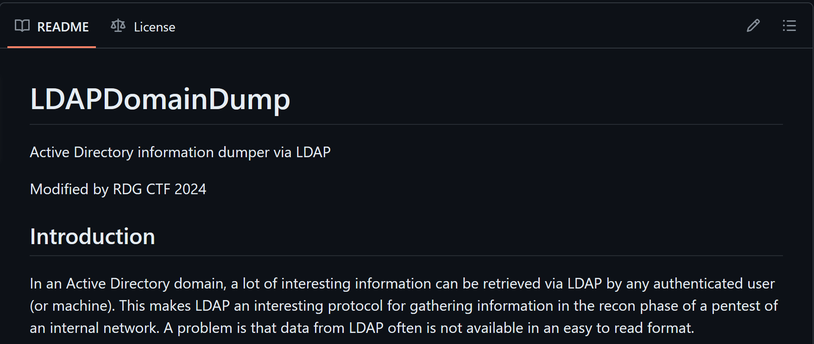
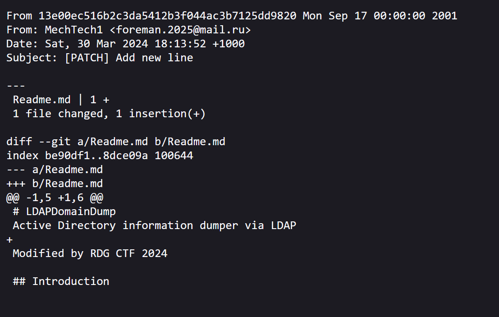
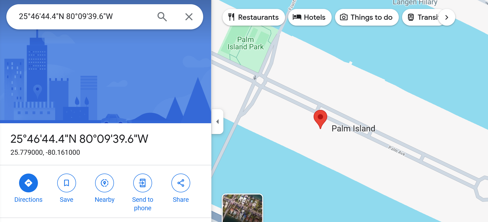

### Задание
Хакер взломавший ДВФУ оставил после себя исходный код проекта, который он использовал в ходе атаки. Необходимо 
вычислить откуда он навел беспорядков. Формат флага:
RDGCTF{место_место}

Ссылка на вложение: https://disk.yandex.ru/d/ff37TPridv9O_Q

## Решение
Предоставленный исходный код является частью проекта [ldapdomaindump](https://github.com/dirkjanm/ldapdomaindump). Переходим на страницу форков данного 
проекта (https://github.com/dirkjanm/ldapdomaindump/forks) и фильтруемся по форкам, созданным за последний месяц


В списке видим один наиболее актуальный форк. Переходим на страницу проекта и убеждаемся, что его исходный код 
соответствует предоставленным нам материалам


Попробуем найти контактные данные автора репозитория. Данные сведения можно извлечь из пользовательских коммитов. 
Открываем страницу одного из коммитов за авторством пользователя MechTech1:
https://github.com/MechTech1/ldapdomaindump/commit/13e00ec516b2c3da5412b3f044ac3b7125dd9820

И добавляем в конце ссылки окончание .patch. Ссылка принимает следующий вид:
https://github.com/MechTech1/ldapdomaindump/commit/13e00ec516b2c3da5412b3f044ac3b7125dd9820.patch

В результате получаем адрес электронной почты злоумышленника


Находим в Telegram открытую группу с названием foreman.2025, где опубликована следующая фотография


Извлекаем метаданные фотографии с помощью утилиты exiftool 
```bash
└─$ exiftool photo_2024-03-30.jpg         
ExifTool Version Number         : 12.44
File Name                       : photo_2024-03-30.jpg
Directory                       : .
File Size                       : 87 kB
File Modification Date/Time     : 2024:03:30 10:31:56+10:00
File Access Date/Time           : 2024:04:05 17:59:29+10:00
File Inode Change Date/Time     : 2024:04:05 17:59:29+10:00
File Permissions                : -rw-------
File Type                       : JPEG
File Type Extension             : jpg
MIME Type                       : image/jpeg
JFIF Version                    : 1.01
Exif Byte Order                 : Big-endian (Motorola, MM)
X Resolution                    : 96
Y Resolution                    : 96
Resolution Unit                 : inches
Y Cb Cr Positioning             : Centered
GPS Version ID                  : 2.3.0.0
GPS Latitude Ref                : North
GPS Longitude Ref               : West
Image Width                     : 642
Image Height                    : 1024
Encoding Process                : Baseline DCT, Huffman coding
Bits Per Sample                 : 8
Color Components                : 3
Y Cb Cr Sub Sampling            : YCbCr4:2:0 (2 2)
Image Size                      : 642x1024
Megapixels                      : 0.657
GPS Latitude                    : 25 deg 46' 44.40" N
GPS Longitude                   : 80 deg 9' 39.60" W
GPS Position                    : 25 deg 46' 44.40" N, 80 deg 9' 39.60" W
```

В метаданных содержатся координаты GPS. Воспользуемся полученными данными для поиска локации в Google Maps


**Флаг:** RDGCTF{Palm_Island}
