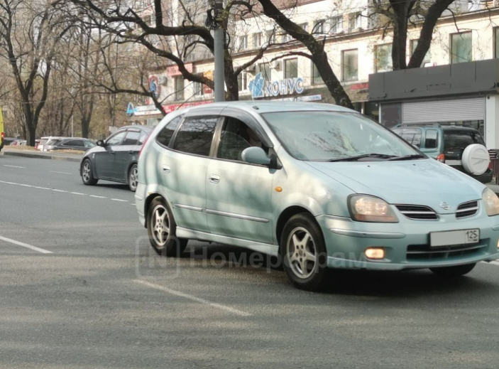
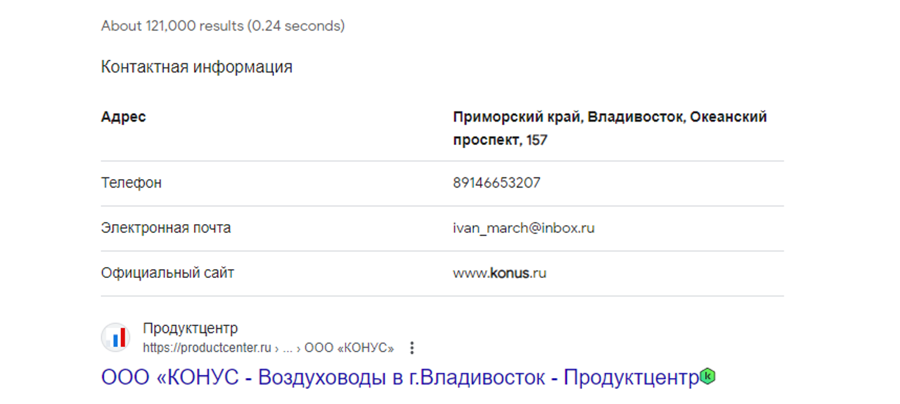
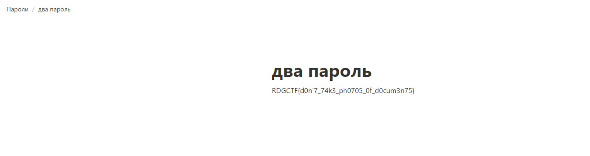
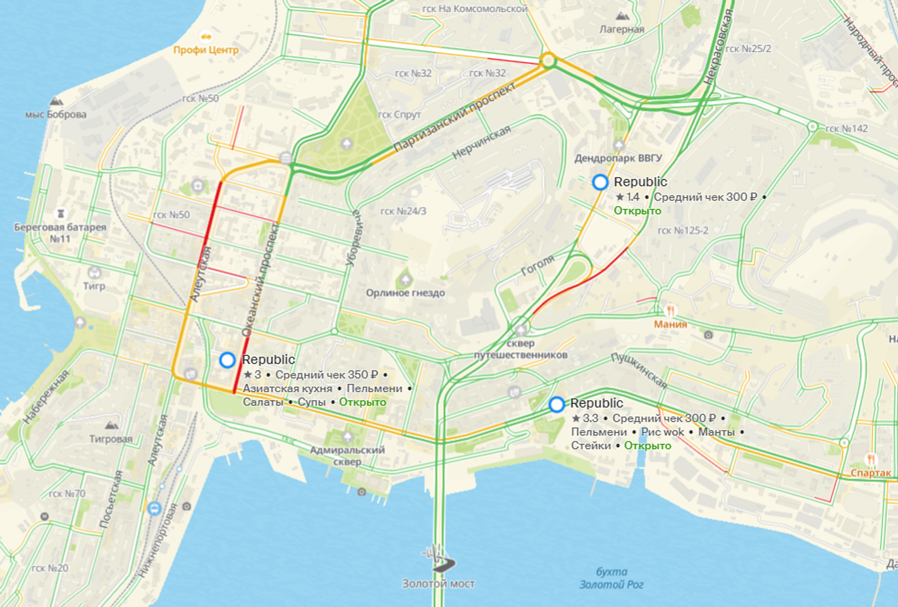
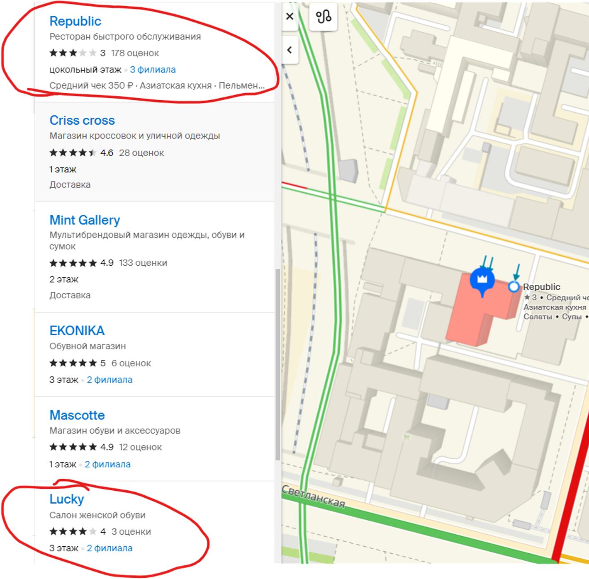
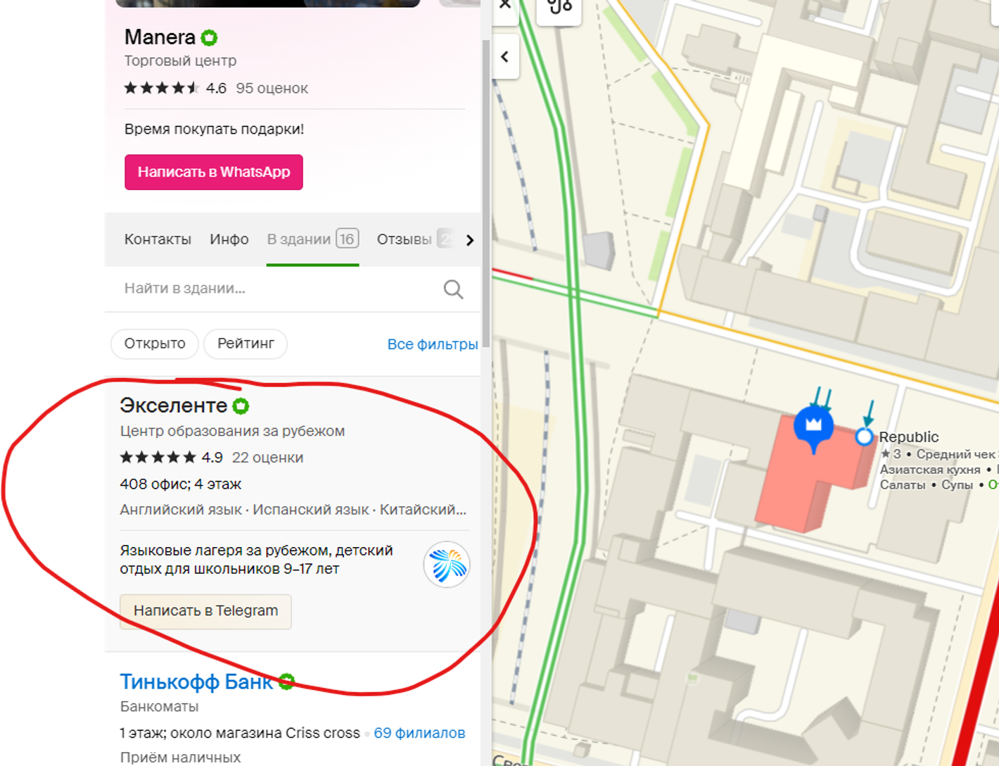
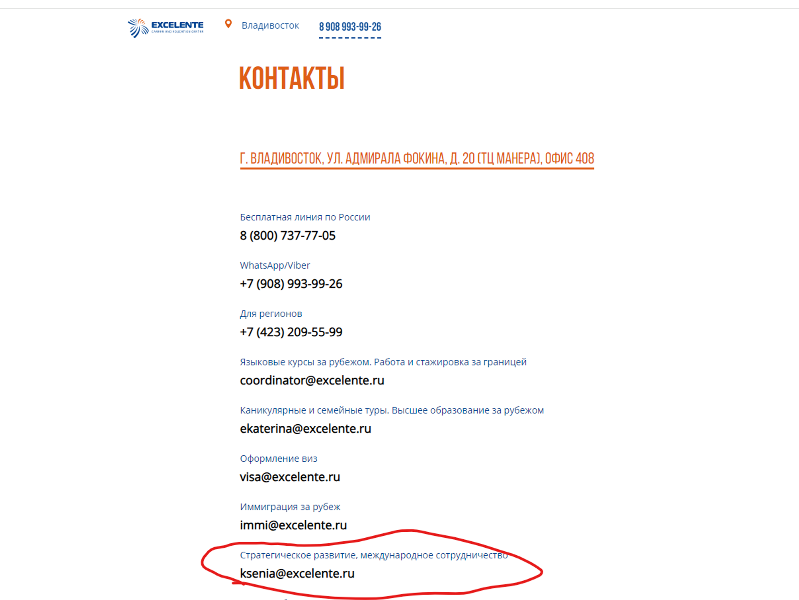
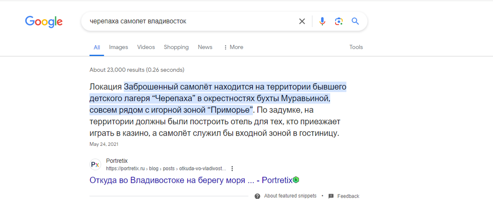
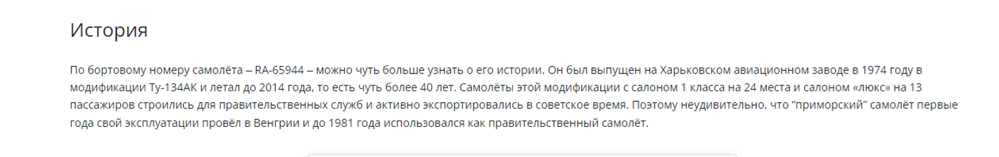

# Последнее сокровище

Все что он сказал было похоже на бред.... Оно лежит в каком-то городе на Дальнем востоке, назывался в честь какого-то Климента... ну и бред.

Формат флага RDGCTF{*Современное название города*_*название города в честь Климента*}

Уссурийск назывался Ворошилов в советское время, в честь Климента Ворошилова.

**Ответ RDGCTF{Ussuriysk_Voroshilov}**

# Голубая бестия

Задание:
Чтобы найти Мориарти, нужно установить все точки, где он мог находится. Наша служба разведки ДВФУ смогла установить возможный автомобиль, на котором передвигался хакер.
Укажи адрес крупного здания, на фоне которого сделано фото.

Пример Флага: **RDG{Borisenko_street_20}**

Решение:
По 125 региону понимаем, что это приморский рай. Видим несколько зацепок, как минимум магазин Конус, гуглим **конус отопление Владивосток**

**Флаг**: **RDGCTF{Okeanskiy_prospekt_157}**

# Ох уж эти контрагенты

**Задание:**

Продолжаем искать... По нашим данным взлом мог произойти через нашего контрагента "ЦИБ&Co", мы нашли их сайт http://cibco.ddns.net/. Посмотрев логи, мы пришли к выводу, что атак из вне не было... Быть может кто-то спалил креды?

**Флаг:** **RDGCTF{d0n'7_74k3_ph0705_0f_d0cum3n75}**

**Решение:**

Идем на сайт http://cibco.ddns.net/ там будет ссылка на вк страницу копании https://vk.com/club225313217

Видим такое фото https://vk.com/club225313217?z=photo-225313217_457239018%2Falbum-225313217_00%2Frev 

Если внимательно прочитать, то в договоре видим ссылку [https://kostetos.notion.site/213e65cd9ed34500ab05f9e475bdd23b](https://www.notion.so/213e65cd9ed34500ab05f9e475bdd23b?pvs=21)

Внутри видим флаг

# Кто он?

Мы выяснили, что хакер был очень удачлив, учился на отлично за рубежом и любил сидеть в Republic. Укажите имя человека, ответственного за развитие.
Имя оберните в формат RDG{name}

**Решение:**

Если вбить **republic в 2GIS**, то это особо нам ничего не даёт, есть 3 таких заведения

Все они находятся в **БЦ** или **ТЦ**. Что если перевести задание на английский язык?

`We found out that the hacker was very lucky, got excellent grades abroad and loved to work at Republic. Provide the name of the person responsible for development.`

Смотрим какие есть компании в этих **БЦ** и видим такое совпадение

**Переходим на сайт “Экселенте”**

https://excelente.travel/

**Переходим в раздел “Контакты”**

https://excelente.travel/contact/

**Флаг**: **RDGCTF{ksenia}**

# Вы его почти поймали!

Возможно хакер к нам добрался на черепахе... Ну а почему бы и нет)

В каком году был выпущен самолет? Год оберни в формат** RDGCTF{date}**

Решение:

Гуглим, черепаха самолет Владивосток

**Флаг:** **RDGCTF{1974}**