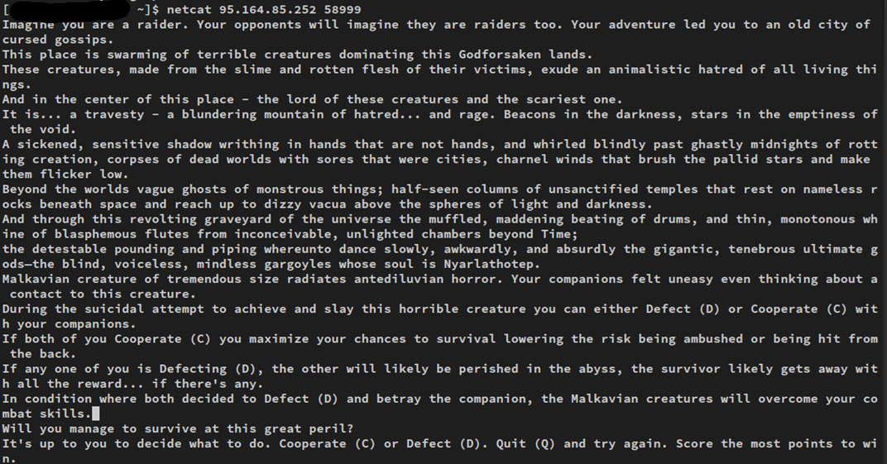
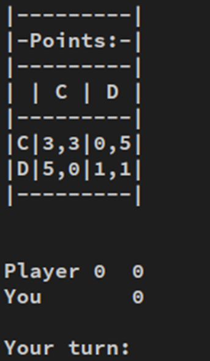
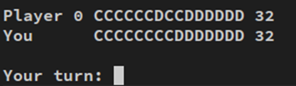
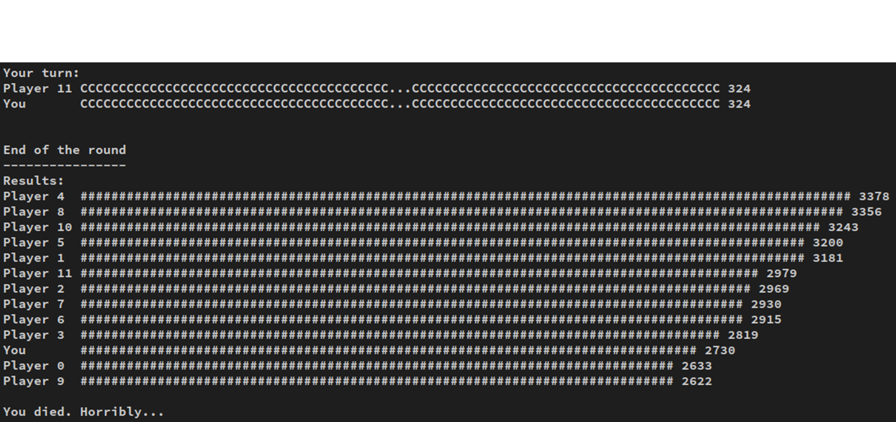
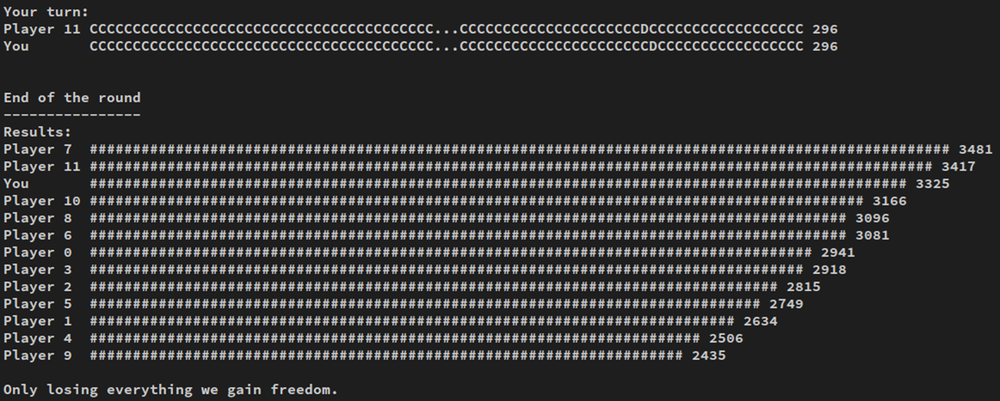
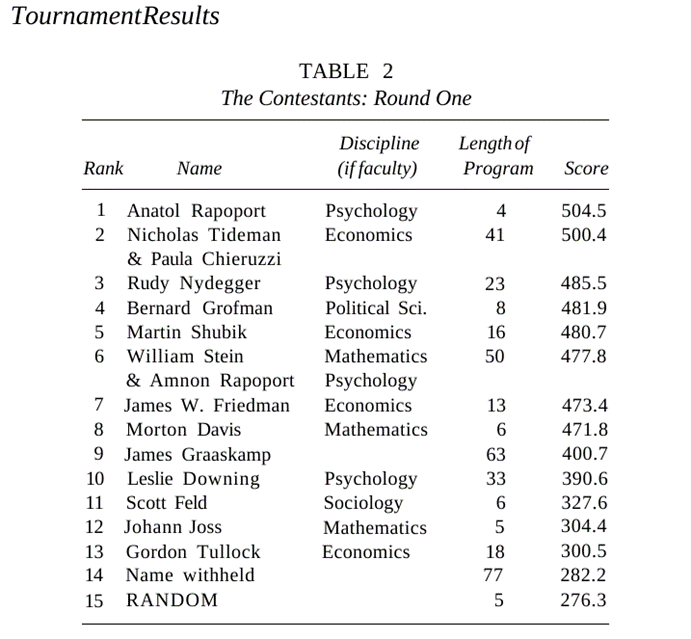

# Задание

Необходимо подключиться по TCP к серверу и обмениваться сообщениями с сервером в интерактивном режиме.
Для подключения вручную использовать одну из утилит: ncat (netcat), telnet, putty.
При подключении к серверу объясняются правила игры и выводится одна из нескольких сюжетных линий



Каждый ход нужно принимать решение: продолжать кооперироваться (C) или отступиться (D).
В зависимости от решения каждая сторона получает определенное количество очков

Самое выгодное решение — отступиться (D) на текущем ходе против кооперации (C) оппонента. Однако, оппонент может сделать это первым, а взаимное отступление даст самый невыгодный результат для обеих сторон.
Кроме того, оппонент потеряет доверие, что может сказаться на его действиях в будущем.

В текущей версии представлено 12 игроков (ботов); каждый реализует свою уникальную стратегию для достижения результата.
1 раунд с каждым игроком.
Каждый играет с каждым.
100 +/- 10 ходов в одном раунде.
Каждому игроку предстоит сделать около 1200 ходов, а всего будет сыграно 78 раундов.

**Решение**

Напишем небольшую программу для общения с сервером на языке Python:

```python
from socket import *
# создаем TCP сокет и подключаемся по указанному IP, порту
s = socket(AF_INET, SOCK_STREAM)
s.connect((HOST, PORT))
text = s.recv(20_000) 
# принимаем сообщение сервера
while True:
	text = s.recv(20_000) 
    print(text.decode())
    if text == b"":
        break
    elif text.endswith(b"Your turn: "):
    s.send(b"C\n") 
    # отправляем решение
s.close()
```

Теперь мы умеем отсылать серверу однообразные ответы. Такой подход не приведет к положительному результату


Попробуем отправлять разные решения, в зависимости от последнего хода оппонента:

```python

iteration = 0

def make_decision(msg: bytes) -> bytes:
    if iteration == 0:
        return b"C"
        # парсим последнее решение оппонента
        match = re.search(br"Player \d+\s+(C|D|\.)*?(?P<decision>C|D) \d+", msg)
    if not match:
        raise ValueError("Can't find last decision")
    match match.group("decision"):
        # отвечаем зеркально
        case b"C":
            return b"C"
        case b"D":
            return b"D"
        case _:
            raise ValueError

```
Уже лучше. Такой стратегией можно даже случайно выиграть, если другие игроки покажут результат ниже обычного. 

Вот и всё! Улучшая стратегию можно добиться стабильной победы в игре.
Единственно правильной стратегии нет.
Для сложной стратегии может понадобиться учитывать несколько последних ходов оппонента.
Для правильного парсинга ответов имеет смысл обратить пристальное внимание на данные, возвращаемые из recv. Некоторые строки могут быть фрагментированы или, наоборот, слиться в одно сообщение.

**История**

В прошлом веке американский политолог Роберт Аксельрод проводил такой эксперимент между программами от разных людей.
Более 60-ти людей прислали Роберту свои программы.

Он заметил, что наиболее стабильные высокие результаты показывала программа TitForTat или «Око за око», присланная американским философом Анатолием Рапопортом.
В 1984 году Роберт написал книгу «The Evolution of Cooperation».

Анализируя стратегии, набравшие лучшие результаты, Аксельрод назвал несколько условий, необходимых, чтобы стратегия получила высокий результат:

- Добрая. Важнейшее условие — стратегия должна быть «доброй», то есть не предавать, пока этого не сделает оппонент. Почти все стратегии-лидеры были добрыми. Поэтому чисто эгоистичная стратегия по чисто эгоистическим причинам не будет первой «бить» соперника.
- Мстительная. Успешная стратегия не должна быть слепым оптимистом. Она должна всегда мстить. Пример прощающей стратегии — всегда сотрудничать. Это очень плохой выбор, поскольку «подлые» стратегии воспользуются этим.
- Прощающая. Другое важное качество успешных стратегий — уметь прощать. Отомстив, они должны вернуться к сотрудничеству, если оппонент не продолжает предавать. Это предотвращает бесконечное мщение друг другу и максимизирует выигрыш.
- Независтливая. Последнее качество — не быть завистливым, то есть не пытаться набрать больше очков, чем оппонент.

Вывод: будьте добрыми, мстительными, прощающими и независтливыми и наберете максимум очков в нашей игре под названием «жизнь».
