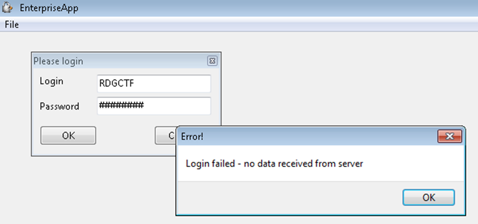
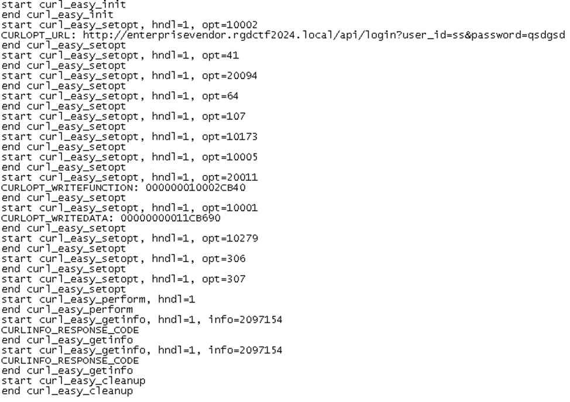
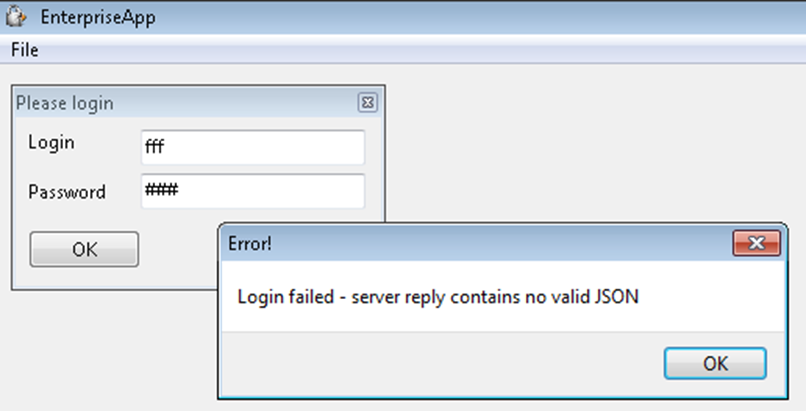
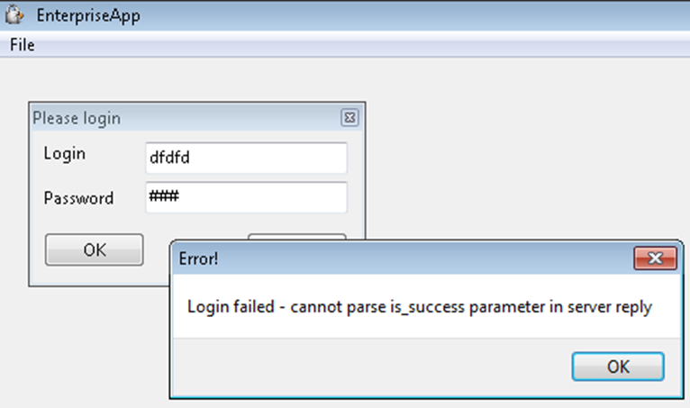
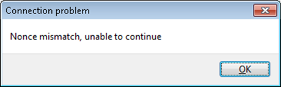
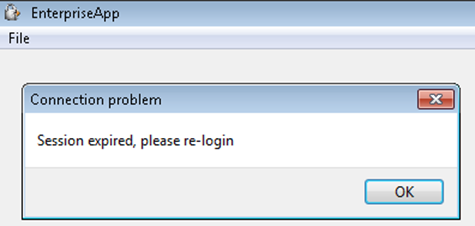
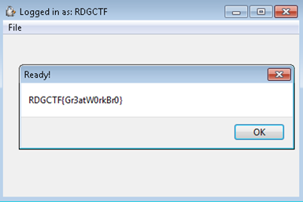

Задание представляет собой подобие некого корпоративного ПО, которое для своей работы требует произвести вход с использованием учетных данных пользователя. Первым делом пробуем сделать это, используя указанные в задании учетные данные:

Ожидаемо, ничего не выходит – программа сообщает нам, что не получила ответных данных от сервера, и работать отказывается.
Посмотрим теперь внимательнее на сами файлы задания. Их два – основной исполняемый файл с именем **WorkSystem.exe** и библиотека **libcurl-x64.**DLL****, без которой основной исполняемый файл запускаться категорически отказывается. Пробуем открыть его в дизассемблере – и понимаем, что программа защищена с использованием относительно свежей версии протектора **VMProtect**. Заниматься «в лоб» его реверсом – занятие не самое приятное и весьма небыстрое. Времени на это вряд ли хватит. Вспоминая про название задания, оставляем файл **WorkSystem.exe**  в покое – пусть этот «черный ящик» работает сам по себе, а мы попробуем пойти другим путем.
Следующая мысль, которая может прийти в голову – попробовать посмотреть на выполняемые программой коммуникации в сниффере. Открываем **WireShark** – и понимаем, что малыми усилиями ничего понять не выйдет. Программа использует технологию `DNS-over-HTTPS (DoH)`, и единственное, что мы невооруженным взглядом увидим в сниффере – это разрешение домена `dns.cloudflare.com`, на котором и расположен сервер `DoH CloudFlare`. Чтобы выяснить точный адрес сервера, к которому будет обращаться программа, потребуется реализовать атаку MITM с подменой сертификата для `«прослушивания»` общения клиента и сервера. Но мы пойдем другим путем.
Обращаем внимание на второй файл – библиотеку **libcurl-x64.DLL**. Если вдруг мы не знаем, что это такое, то используем поисковик – и узнаём, что это весьма популярная библиотека для сетевого обмена, поддерживающая многие протоколы. Но самое главное – она имеет открытый исходный код, подробное описание `**API**…` и не защищена **VMProtect**’ом! Впрочем, даже будь она защищена протектором, можно было бы просто скачать незащищенную версию с сайта проекта и использовать её.
Логично предположить, что весь обмен исследуемого нами приложения с сервером ведется как раз посредством вызовов `**API**`, предоставляемых **libcurl-x64.DLL**. А раз так – мы можем «подложить» вместо оригинальной `**DLL**` свою, которая и будет `«вести обмен с сервером»`, скармливая приложению данные, которые ему нужны для успешной работы. Но для написания своей `**DLL**` нам потребуется знать, какие вызовы **API** библиотеки производятся приложением. Чтобы это узнать, есть несколько путей:
1)	Пропатчить все экспортируемые `**DLL**` функции (в статике или динамике), поместив в их начало наш код, который будет логировать все вызовы **API**
2)	Воспользоваться каким-нибудь генератором прокси-**DLL**, которые в немалом количестве существуют на GitHub, также залогировав все вызовы **API** в нем
Так или иначе, мы получаем примерно следующую последовательность вызовов в логе:

Вооружаемся доками, которые любезно предоставляют нам разработчики `libcurl` на своем сайте, и начинаем выяснять, как это работает и что там происходит.
А происходит следующее. Сначала вызывается `curl_easy_init`, которая создает новый запрос и возвращает хэндл для дальнейшей работы с ним из приложения. Затем вызовами `curl_easy_setopt` приложение выставляет требуемые параметры запроса – `URL` (абсолютно неудивительно, что никаких данных от сервера приложение не получает – такого адреса просто не существует), параметры DOH, учетные данные. Среди прочих особенно интересны тут два параметра: `CURLOPT_WRITEFUNCTION` и `CURLOPT_WRITEDATA`. Первый задает адрес `callback`-функции, которую библиотека должна вызывать при получении новых данных во время выполнения запроса, а второй является аргументом, с которым эту функцию следует вызывать. Запоминаем их.
После того, как все необходимые параметры запроса будут сконфигурировны вызовами curl_easy_setopt, приложение вызывает функцию `curl_easy_perform`, запуская запрос на выполнение. Именно в этот момент нам и потребуется вызвать `callback`-функцию, которую мы получили в параметре `CURLOPT_WRITEFUNCTION`, чтобы попытаться убедить приложение в том, что поступили какие-то данные от сервера. После завершения выполнения вызывается `curl_easy_getinfo`, в которой параметр `CURLINFO_RESPONSE_CODE` заставляет библиотеку вернуть код, с которым завершился запрос. Обычно для `HTTP` запросов в качестве кода успешного завершения выступает число `200` – его мы и будем возвращать. Ну и завершающим аккордом выступает вызов `curl_easy_cleanup`, сообщающий библиотеке, что работа с запросом окончена и все выделенные под него ресурсы можно освободить.
Вооружившись этими данными, мы можем приступать к реализации своей логики внутри библиотеки. Для этого можно воспользоваться сгенерированным кодом `«прокси-ДЛЛ»`, а можно и попробовать создать ДЛЛ с нуля. Если наши «заглушки» на месте вызовов **API** окажутся реализованы правильно, то при попытке логина выдаваемая приложением ошибка изменится.

Несложно догадаться, что в ответе сервера приложение ожидает увидеть данные в формате `JSON`. Это достаточно известный и широко используемый формат, в котором параметры передаются в виде пар `«название параметра – значение»`. Если мы предоставим приложению любой валидный `JSON`, то ошибка снова изменится:

Добавляем в JSON этот параметр, если все сделано правильно и мы угадали с типом и значением (для параметра is_success приложение ожидает число 1), ошибка снова меняется, каждый раз предоставляя нам сведения об остальных недостающих в запросе параметрах. Для того, чтобы успешно залогиниться в приложение, нам потребуется предоставить в ответе следующий набор параметров:
- is_success – число 1- показывает успешную авторизацию пользователя на сервере
- timestamp – строка со временем авторизации на сервере в стандартном для JSON формате (например, "2024-03-21T18:25:43-05:00")
- session_id – строка с идентификатором сессии, можем использовать любую (главное не менять ее при ответах в процессе работы приложения)
- user_id – строка с идентификатором пользователя, она будет выводиться в заголовке окна приложения. Как мы помним из описания задания, именем пользователя должно быть RDGCTF. При ином имени пользователя в приложение также получится залогиниться, но при запуске генерации флага будет возникать ошибка, сообщающая, что только пользователь RDGCTF может выполнить данное действие.
После правильного выставления указанных параметров первый запрос (по адресу https://enterprisevendor.rgdctf2024.local/**API**/login ) успешно завершится, но сразу за ним возникнет новый – на URL https://enterprisevendor.rgdctf2024.local/**API**/heartbeat. Его обработка потребует добавить в ответ параметр cmd_id, имеющий числовой тип и значение 0, а также числовой параметр nonce и строковый параметр data.  И если значение data мы можем задать произвольно, то с nonce у нас возникнет следующая ошибка:

Внимательнее смотрим на URL, по которому пытается обратиться приложение, и находим там одноименный параметр со случайным значением, меняющимся при каждом запуске программы. Запоминаем его и повторяем в ответе – ошибка пропадает, авторизация завершается успешно, а мы получаем возможность наконец-то запустить процедуру генерации флага! Однако через несколько секунд нас ожидает очередная проблема:

Понимаем, что запрос на https://enterprisevendor.rgdctf2024.local/**API**/heartbeat выполняется не однократно, а периодически, и при втором обращении нас приложение нас «разлогинивает», не давая завершить генерацию флага. Впрочем, эта проблема решается несложно – достаточно лишь сообщать в каждом новом ответе всё большее значение timestamp. Вносим изменения, запускаем приложение, жмем `Generate` `Flag` и после недолгого ожидания видим:

