# susoicion mail

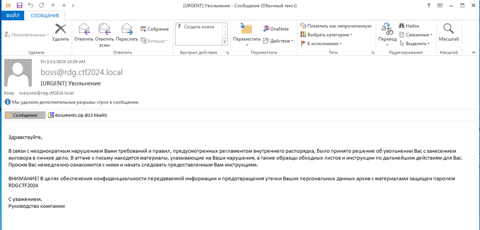
Полученное письмо содержит архив.
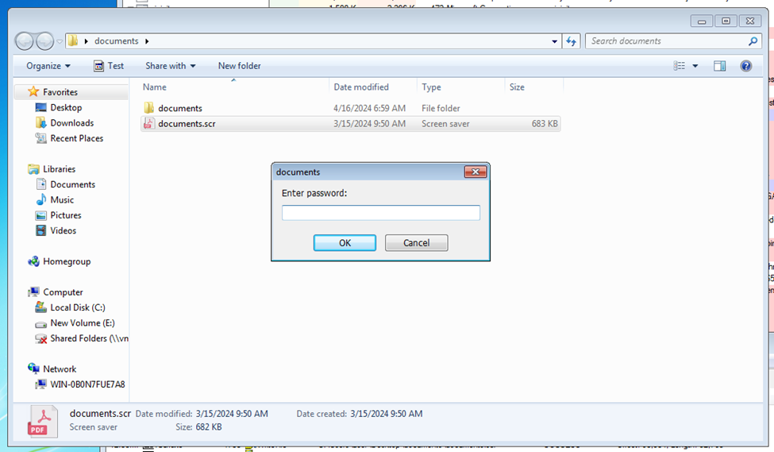
Внутри архива исполняемый файл, который просит пароль, описанный в письме.
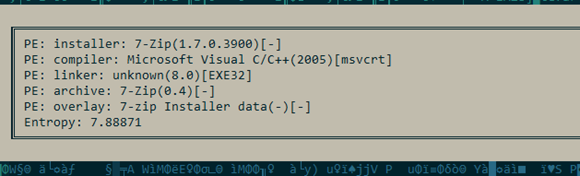
Откроем его, и поймём, что это самораспаковывающийся архив.
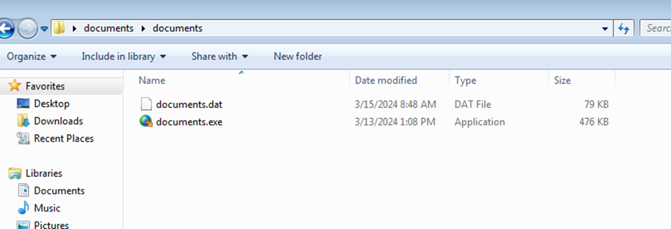
Разархивируем его и увидим, что внутри два файла с одним названием, но с разными расширениями.
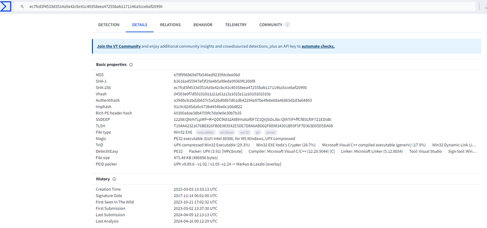
Exe файл известен уже давно и помечается как чистый.

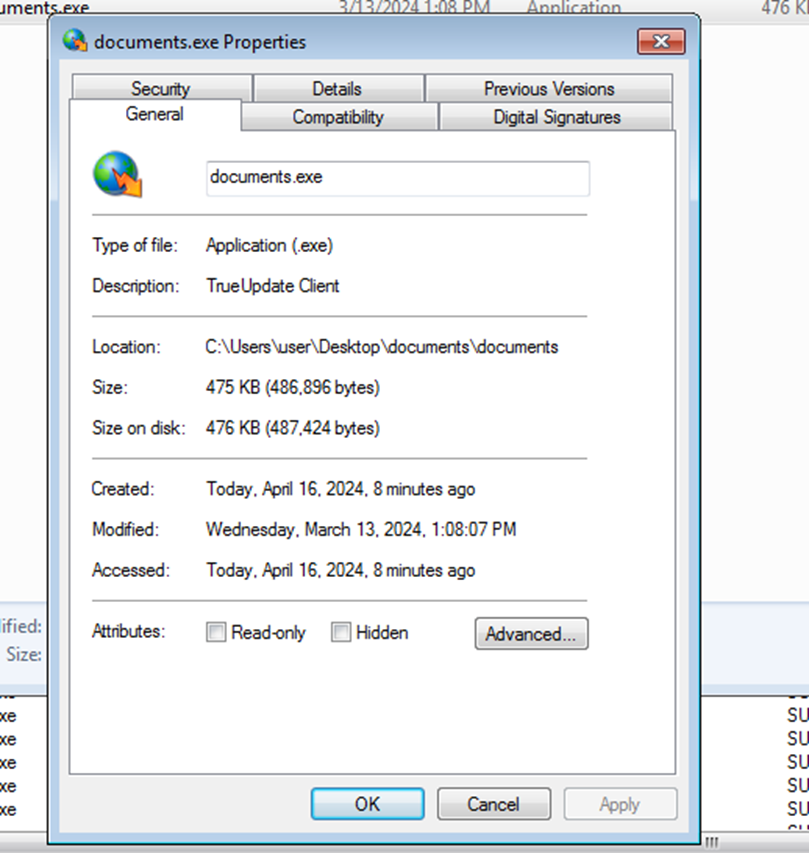
Заявляется, что это **TrueUpdate Client**, который разработан компанией **Indigo Rose**, и даже веб-сайт этой компании указан! Идём туда и узнаём, что имеем дело ни с чем иным, как с «первоклассным решением для разработчиков, желающих использовать автоматическое обновление ПО».
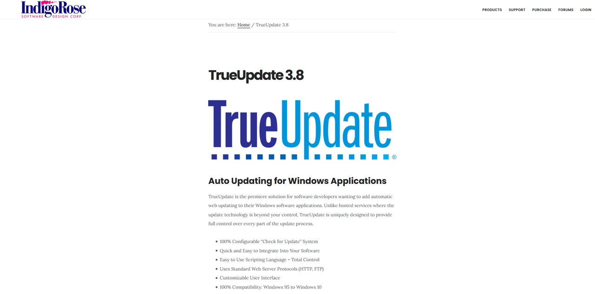
Но в первую очередь нас интересует то, как эта штука работает – и для понимания этого как нельзя лучше подходит пробная версия TrueUpdate, которую без труда можно найти и скачать. Давайте же посмотрим на неё поближе.
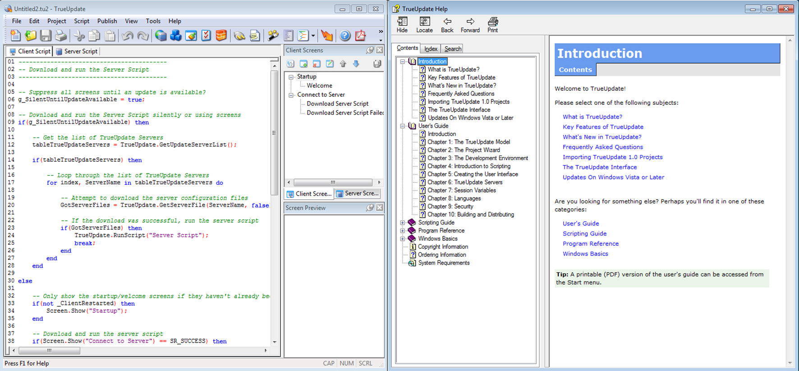
Как следует из прилагаемого руководства, это ни что иное, как своеобразная IDE, при помощи которой разработчик может развернуть инфраструктуру для удобного распространения и обновления своего ПО. Для каждого проекта в данной IDE при помощи **LUA-подобного** скриптового языка пишется пара скриптов – один для выполнения на клиенте, на котором происходит обновление, а второй – для работы на сервере обновлений. Клиентская часть затем собирается в дистрибутив и распространяется среди пользователей ПО, а серверная размещается на контролируемых разработчиком серверах, с которых в дальнейшем и происходит процесс скачивания обновлений клиентской частью. Действия клиентской части полностью определяются содержимым скрипта, сам скрипт находится в упакованном виде внутри прилагающегося ****dat-файла**** (который является защищенным паролем **ZIP-архивом**), а **TrueUpdateClient.exe** является ничем иным, как своего рода интерпретатором, извлекающим клиентский скрипт из **dat-файла** и выполняющим его. Отсюда следует и второй вывод – пароль от архива содержится внутри **TrueUpdateClient.exe**, и если каким-то образом узнать его, то можно попробовать подменить скрипт в архиве! Давайте вернёмся к нашему файлу.
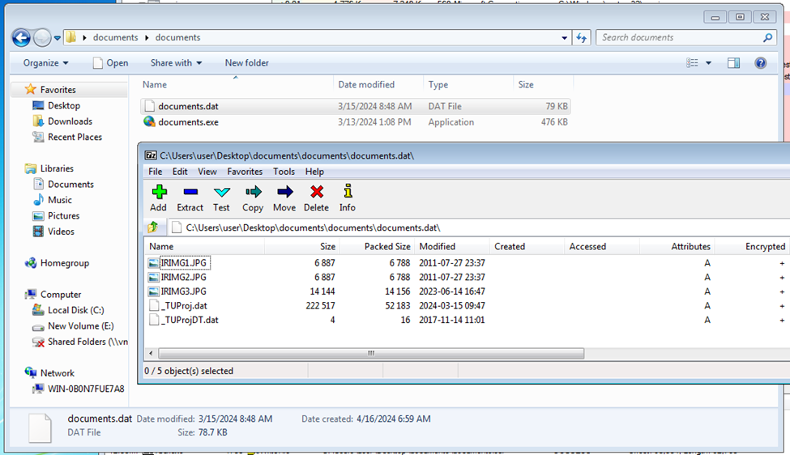
Открываем .exe в **IDA**. Сам файл упакован, но так как в качестве упаковщика использован **UPX**, распаковать его не составляет никакого труда. Далее находим строку **«_TUProj.dat»,** которая соответствует названию файла со скриптом внутри зашифрованного архива, по перекрестным ссылкам смотрим, где она используется, и находим следующий фрагмент кода, выполняющий работу по извлечению содержимого архива в память процесса:
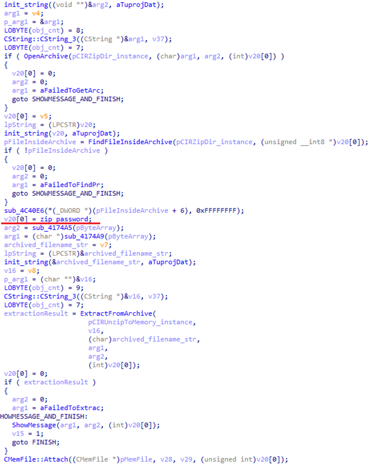
Вся предлагаемая TrueUpdate «защита» клиентского кода сводится к стандартному шифрованию **ZIP-архива**, пароль от которого хранится в исполняемом файле в открытом виде. после извлечения из архива файла **_TUProj.dat**.
После распаковки файла, видим в нём скрипт:
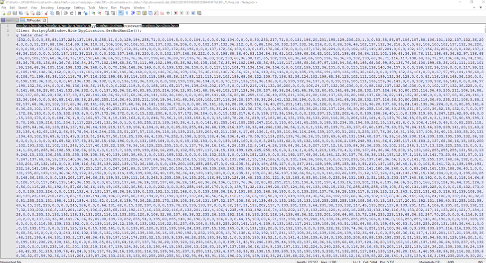
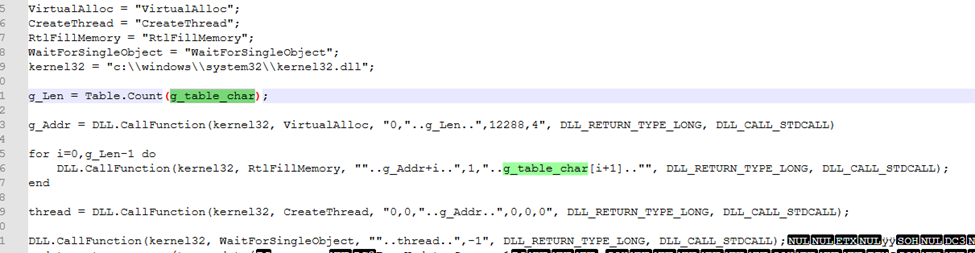
Как видим, кроме клиентского скрипта этот файл содержит также ряд иных ресурсов, использующихся программой. Сразу же обращает на себя внимание переменная **g_table_char**, которой присваивается набор чисел, сильно напоминающий шеллкод. Затем вызовом **VirtualAlloc** происходит выделение области памяти, достаточной для размещения в ней шеллкода, и побайтовое его копирование вызовами **RtlFillMemory**. После того, как шеллкод успешно размещён в памяти, вызовом **CreateThread** создаётся новый поток, начинающий выполнение шеллкода, а скрипт ожидает его завершения. После того, как шеллкод отработал, скрипт завершает выполнение. 
Давайте теперь внимательнее посмотрим на шеллкод. Откроем его в иде.
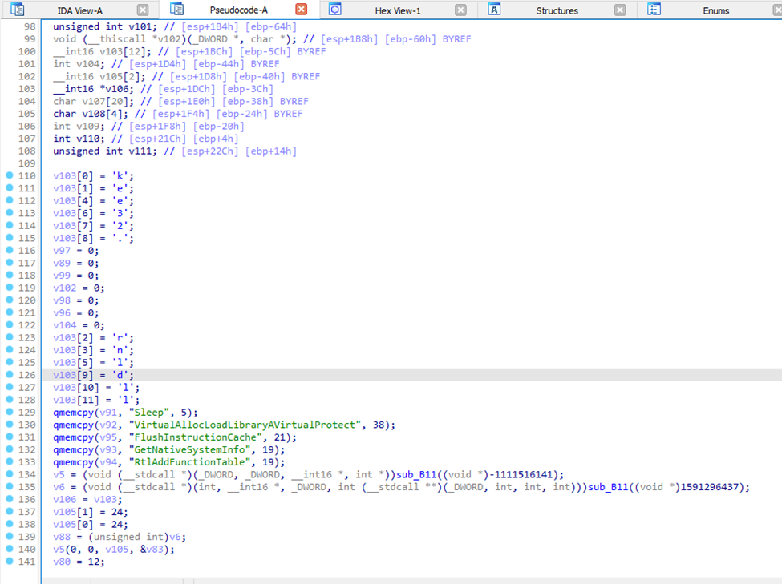
Анализ шелкода оставим вам, приведём его основную суть:

1) Получаем имя текущего пользователя;
2) Считаем от него **CRC32**;
3) Если **CRC32** совпадает со значение **0x6E20E345**, то выводится флаг;
Под подходящую **CRC32** попадает большое количество пользователей, одним из которых является **RDGCTF_UPDAT3_TRUE**. Создадим его и попробуем запустить файлик с самого начала.
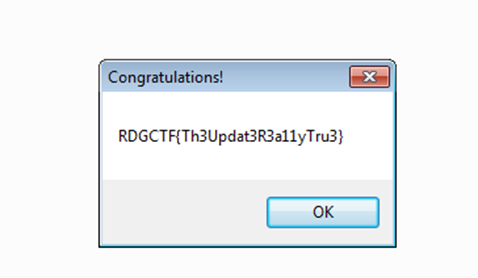