Файл mrbob.exe:
1. Главная функция:
    - Регистрирует новый VEH callback
    - Создает 3 TLS слота, два из которых будут использоваться для хранения определенных значений:
         1) TLS слот с индексом 0x1 будет использоваться в VEH callback для отслеживания выполнилась ли загрузка шеллкода или нет
         2) TLS слот с индексом 0x2 хранит указатель на стек, где лежит адрес возврата из программы для корректного её завершения.
         3) TLS слот с индексом 0x3 содержит битовый флаг, который сигнализирует, правильно ли был введет ключ или нет. Данный флаг проверяется уже в самом шеллкоде.
    - в конце функции уже создается исключения EXCEPTION_ILLEGAL_INSTRUCTION, откуда нас перекидывает на зарегистрированный callback для обработки исключения
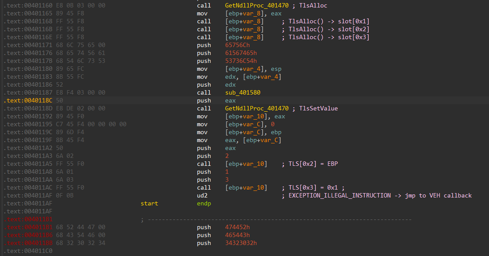

2. VEH callback:
    - обрабатывает 3 типа исключений `EXCEPTION_ILLEGAL_INSTRUCTION` (0xC000001D), `STATUS_PRIVILEGED_INSTRUCTION` (0xC0000096), `STATUS_ACCESS_VIOLATION` (0xC0000005). В ходе обработки исключений проверяется TLS[0x1], где хранится информация о том, был ли загружен шеллкод или нет.
    Если шеллкод не загружен (TLS[0x1] == 0), то соответственно вызываем функцию (по виртуальному адресу `0x401190`) загрузки шеллкода (2).
    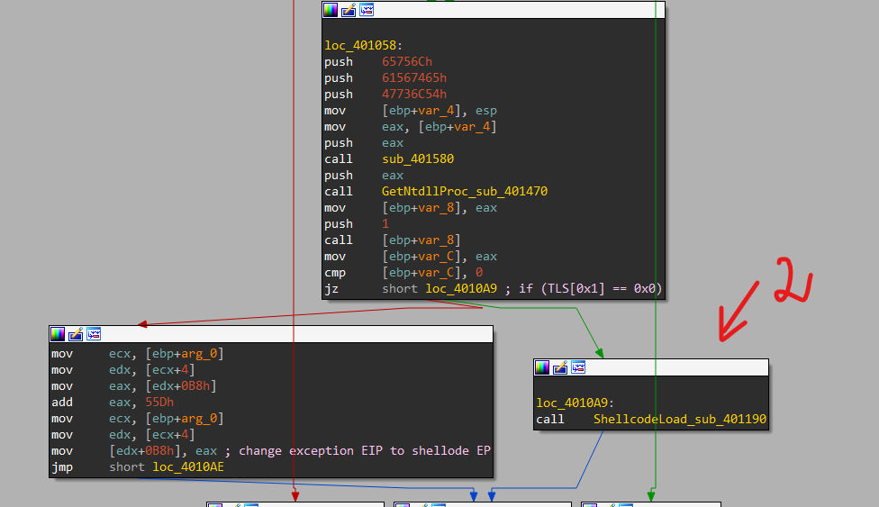

    Загрузка шеллкода достаточно тривиальная - считываем код из файла shellcode.bin (1) и загружаем в выделенную память с RWX правами, сохраняем полученный адрес в TLS[0x1], далее запускаем (2) шеллкод:
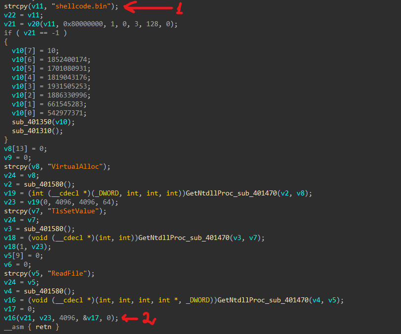
    Первая попытка выполнить шелл код вызовет исключение из-за привилигированной инструкции:
    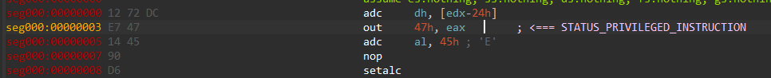
    Обработка исключения перейдет в VEH callback, где вычисляется offset до EP шеллкода. По итогу приходим в данную функцию (offset +0x55D) (по умолчанию, к примеру, IDA может её не распознать как функцию и поэтому не будет отображаться в листинге функций):
    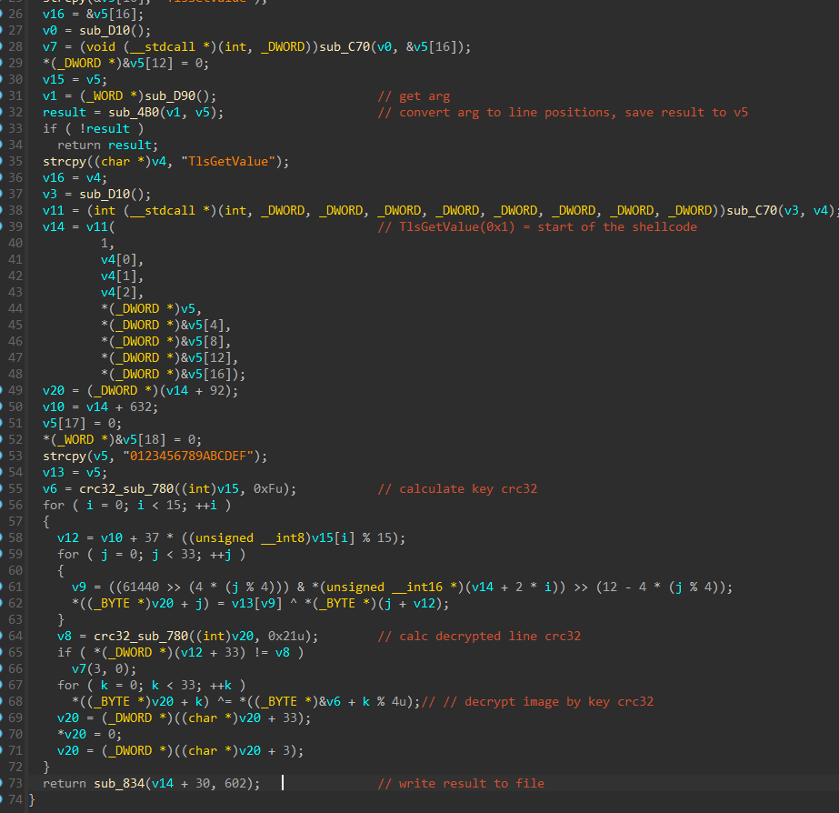
    
    С переименованными и правильно типизированными переменными:
    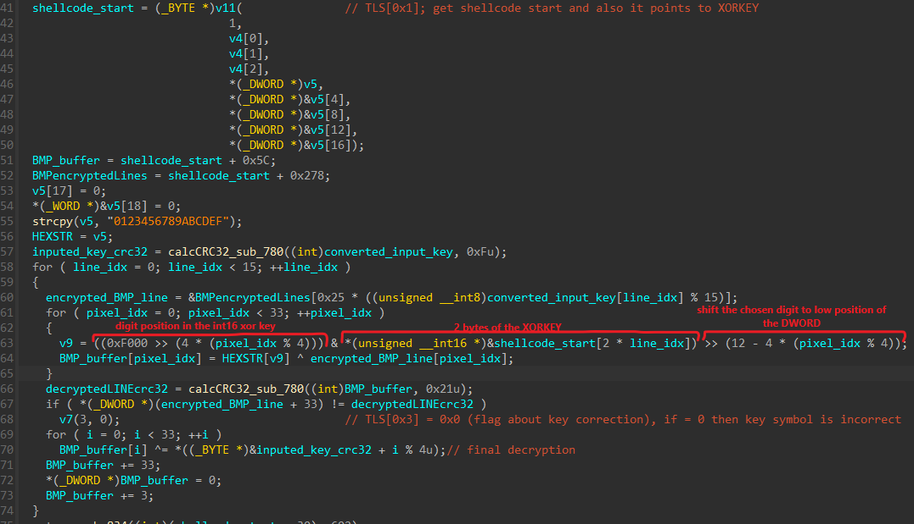
    В данной функции и происходит расшифровка изображения на основе введенного ключа.
    
    Кратко о шифровании: от введенного ключа берется лишь 15 байт, каждый байт преобразуется по модулю 15 (это высота BMP изображения). Каждый байт - это позиция пиксельного ряда картинки. Таким образом задача сводится к вводу правильной последовательности позиций (шифрование перестановки).
    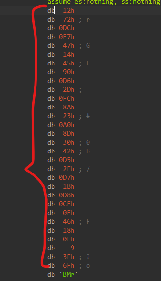
    Каждый ряд расшифровывается XOR-ом на основе ключа из начала данных шеллкода. После сравнивается значение упрощенной crc32 расшифрованного ряда (https://github.com/komrad36/CRC/blob/master/CRC/naive_methods_cpp.cpp) с захардкоженной crc32, которая идет после шифрованной строки картинки.
    То есть по факту, чтоб узнать верный байт (позицию строчки), достаточно эту строку пошифровать 15 раз байтами из ключа из начала шеллкода, вычислить для каждой crc32 и сравнить с захардкоженным.
    На каждую строчку берется по 2 байта из ключа, которые преобразуются в 4 байта (например, 0x7212 -> в строку "7212"). Далее уже строка расшифровыватся xor-ом ключом на 4 байта.

    Вычисляется crc32 расшифрованной строки и сравнивается с захардкоженной crc32. Если совпадает, то позиция верная, а значит и символ ключа верен.
    В завершающий этап картинка xor-тся crc32 от ключа, который мы вводили.
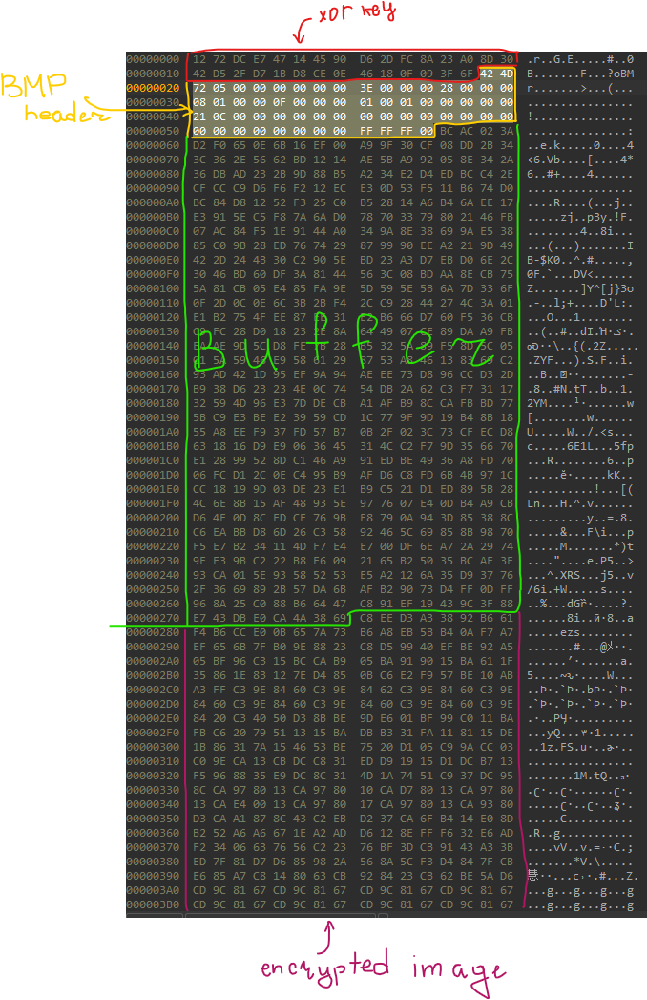


По итогу, к примеру, можно сделать вот такой сценарный скриптец для дебаггера (в данном случае x32dbg), для определения правильных позиций:
```c
start:
	mov globcounter, 0xF // KEY len
	mov startcip, cip // save current EIP value
	mov POS, 0x0 // POS - the value which we will bruteforce

loop:
	cmp POS, 0xF
	je exit

	mov eax, POS
	mov cipbuf, cip
again:
	step
	cmp cipbuf, cip
	je again
	run // to the next breakpoint where we compare crc32

	step
	cmp ecx, 0x0 // if ecx == 0 then we found right position 
	je found
    // else we increment POS and set EIP to back (to try next POS value)
	inc POS
	mov cip, startcip
	xor edx, edx
	jmp loop
found:
	log "[found] POS = 0x{x:$POS}"
	dec globcounter
	mov POS, 0x0
	cmp globcounter, 0x0
	je exit
	run
	run
	jmp loop
exit:
	log "== DONE =="
```
Перед запуском скрипта нужно правильно расставить бряки:
1. Первый ставим на моменте, где считывается байт ключа
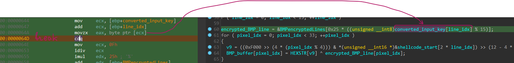
2. Второй ставим там, где сравниваются crc32. Если равны, то ecx == 0.
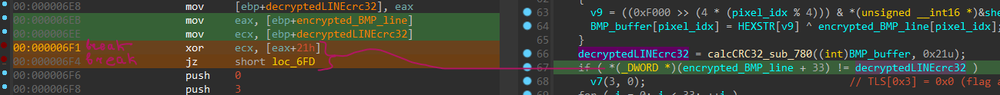

Доходим до первого бряка и запускаем скрипт. Отфильтровав вывод журнала получим вот такой вывод:
```
[found] POS = 0x8
[found] POS = 0xE
[found] POS = 0xC
[found] POS = 0x2
[found] POS = 0x0
[found] POS = 0x6
[found] POS = 0xA
[found] POS = 0x4
[found] POS = 0x9
[found] POS = 0x3
[found] POS = 0x1
[found] POS = 0xB
[found] POS = 0x7
[found] POS = 0x5
[found] POS = 0xD
```
Далее просто преобразуем по обратному принципу (+0xF) в ascii символы.
```python
print("--KEYS--")
positions = "8EC206A4931B75D"
MODULE = 0xF
for i in range(8):
	key = []
	for j in positions:
		key.append(int(j, 16) + i * 0xF)
	print("%d*0xF:" % i, bytearray(key))
```
Получим такой список ключей:
```python
--KEYS--
0*0xF: bytearray(b'\x08\x0e\x0c\x02\x00\x06\n\x04\t\x03\x01\x0b\x07\x05\r')
1*0xF: bytearray(b'\x17\x1d\x1b\x11\x0f\x15\x19\x13\x18\x12\x10\x1a\x16\x14\x1c')
2*0xF: bytearray(b'&,* \x1e$("\'!\x1f)%#+')
3*0xF: bytearray(b'5;9/-37160.842:')
4*0xF: bytearray(b'DJH><BF@E?=GCAI')
5*0xF: bytearray(b'SYWMKQUOTNLVRPX')
6*0xF: bytearray(b'bhf\\Z`d^c][ea_g')
7*0xF: bytearray(b'qwukiosmrljtpnv')
```
Берем любой из представленных, например `qwukiosmrljtpnv`
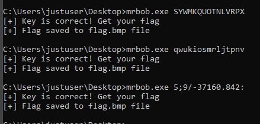

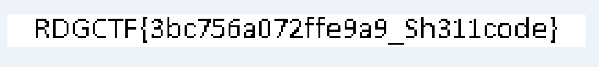