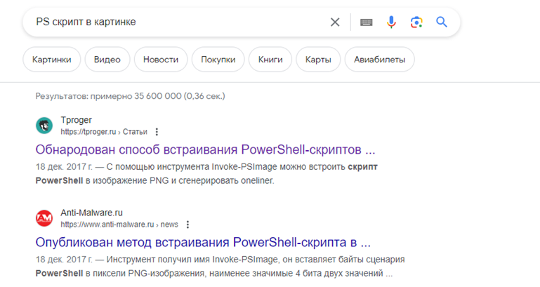
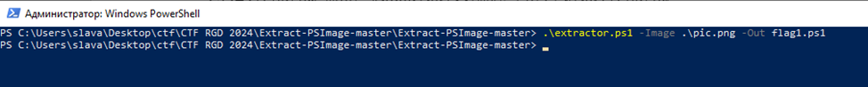
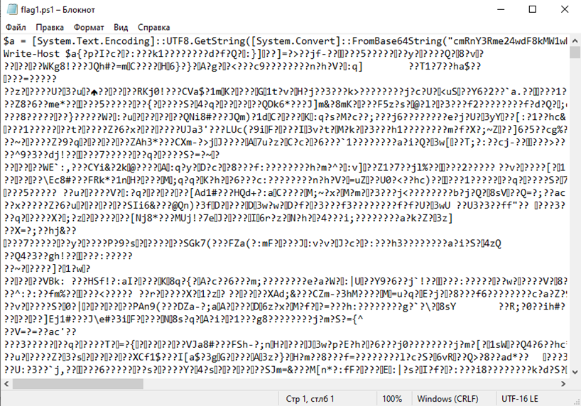
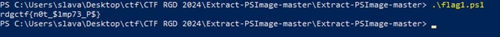
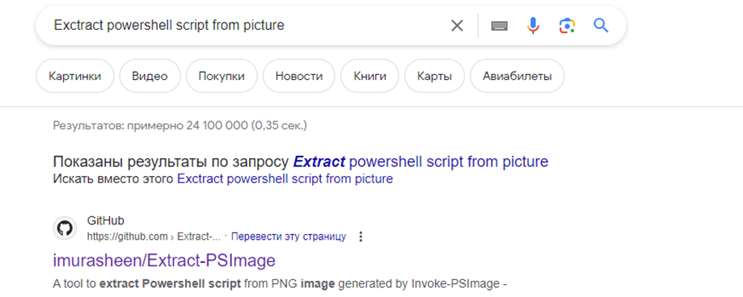

Task: One-line picture
level: Easy 
Category: Stego

Описание: На одном хакерском форуме была найдена вроде бы обычная картинка. Сможете выяснить что она прячет? :)

**Решение**

Writeup на таск «One-line picture»

После того как были использованы все инструменты стегоанализа и безрезультативно, то замечаем, что по заданию картинка «что-то скрывает» и на картинке изображен инструмент PowerShell, то можно предположить, что в картинке зашит какой-то PS скрипт.
Гуглим что-то типа «Hide PS script in picture»

Находим описания утилиты **Invoke-PSImage**.
Прочитав его функционал, гуглим саму утилиту **Invoke-PSImage** и находим его **github** репозиторий
https://github.com/peewpw/Invoke-PSImage

**Решение 1**

Из описания утилиты: «При использовании метода внедрения для хранения полезных данных используются младшие 4 бита двух значений цвета в каждом пикселе».
Однако мы не знаем размер полезной нагрузки, вшитой в картинку, поэтому необходимо написать скрипт, который нам выведет все эти младшие биты.
Эту задачу нам облегчит однострочник из скрипта **Invoke-PSImage.ps1**, который как раз и запускает вшитый **PS** скрипт (**строка 159**):

```
sal a New-Object;Add-Type -A System.Drawing;
`$g=a System.Drawing.Bitmap(`"$Out`");
`$o=a Byte[] $array;(0..$lrows)|%{foreach(`$x in(0..$lwidth)){`$p=`$g.GetPixel(`$x,`$_);
`$o[`$_*$width+`$x]=([math]::Floor((`$p.B-band15)*16)-bor(`$p.G-band15))}};
`$g.Dispose();IEX([System.Text.Encoding]::ASCII.GetString(`$o[0..$lpayload]))
```

Заметим, что переменные **`$rows`, `$array`, `$lrows`, `$lwidth`** вычисляются из размеров изображения и полезной нагрузки. Но размер полезной нагрузки нам неизвестен, поэтому нужно получить максимальную длину полезной нагрузки, которая может быть встроена в данное изображение.
В скрипте это может быть представлено так:

```
[void] [System.Reflection.Assembly]::LoadWithPartialName("System.Drawing")

$rect = New-Object System.Drawing.Rectangle(0, 0, $width, $height);
$bmpData = $img.LockBits($rect, [System.Drawing.Imaging.ImageLockMode]::ReadWrite,
$img.PixelFormat)
$lmaxpayload  = [Math]::Abs($bmpData.Stride) * $img.Height / 2
$img.UnlockBits($bmpData)
$img.Dispose()

Далее получаем параметры для создания экстрактора (строки 147-152 в **Invoke-PSImage**.ps1):
$rows = [math]::Ceiling($lmaxpayload/$width)
$array = ($rows*$width)
$lrows = ($height-1)
$lwidth = ($width-1)
$lpayload = ($lmaxpayload-1)
```

Когда получены все необходимые параметры, необходимые для запуска однострочника выше, видоизменим его, чтобы он записывал все собранные биты в переменную $payload, которую уже поместим в выходной файл:

```
iex("sal a New-Object;Add-Type -AssemblyName `"System.Drawing`";`$g=a System.Drawing.Bitmap(`"$Image`");`$o=a Byte[] $array;(0..$lrows)|%{foreach(`$x in(0..$lwidth)){`$p=`$g.GetPixel(`$x,`$_);`$o[`$_*$width+`$x]=([math]::Floor((`$p.B-band15)*16)-bor(`$p.G-band15))}};`$g.Dispose();`$payload=[System.Text.Encoding]::ASCII.GetString(`$o[0..$lpayload])")
Out-File $Out -inputobject $payload
```

Соединим все созданные куски скрипта в один с входными аргументами `$Image` – анализируемое изображение, `$Out` – выходной файл с младшими битами цветов.
Запустим его с нашим изображением.

При этом создается файл, название которого было указано в параметре –Out при использовании скрипта. 
В нем отображены все наименее значимые 4 бита двух значений цвета каждого пикселя изображения.

Соответственно необходимый нам скрипт, который был вшит в картинку расположен на первых двух строчках созданного файла.
Избавляемся от ненужных символов, запускаем его и получаем флаг.


Ответ: **rdgctf{n0t_$1mp73_P$}**

**Решение 2**

Если погуглить еще лучше по ключевому слову **«PSImage»** или **«Exctract powershell script from picture»**, то можно найти другую утилиту, которая как раз-таки извлекает нужную нам нагрузку, вшитую в картинку

https://github.com/imurasheen/Extract-PSImage
Далее выполняем действия из Readme утилиты и получаем следующий вывод
```
sal a New-Object;Add-Type -AssemblyName "System.Drawing";$g=a System.Drawing.Bitmap("C:\Users\slava\Desktop\ctf\CTF RGD 2024\Extract-PSImage-master\Extract-PSImage-master\pic.png");$o=a Byte[] 398300;(0..378)|%{foreach($x in(0..699)){$p=$g.GetPixel($x,$_);$o[$_*700+$x]=([math]::Floor(($p.B-band15)*16)-bor($p.G-band15))}};$g.Dispose();[System.Text.Encoding]::ASCII.GetString($o[0..397949])|Out-File $Out
[First 50 characters of extracted payload]
$a = [System.Text.Encoding]::UTF8.GetString([Syste
```
При этом создается файл, название которого было указано в параметре –Out при использовании скрипта. 
В нем отображены все наименее значимые 4 бита двух значений цвета каждого пикселя изображения.

Соответственно необходимый нам скрипт, который был вшит в картинку расположен на первых двух строчках созданного файла.
Избавляемся от ненужных символов, запускаем его и получаем флаг.


Ответ: **rdgctf{n0t_$1mp73_P$}**
