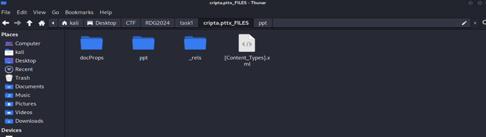
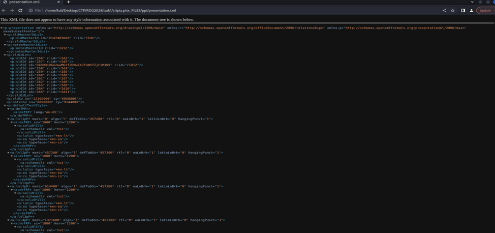

Добро пожаловать на лекцию по крипте

Как думаешь, слайды могут тебе помочь?

**Решение**

**Любой офисный файл – это архив.** Разархивируем нашу презентацию и получаем дефолтный набор.

Это же стега, что-то должно быть. Если перебирать все файлы, то в одном из них 
**cripta.pttx_FILES/ppt/presentation.xml** можно увидеть следующее

Между id 257 и id 258 можно увидеть элемент с непонятным айдишником, что должно навести на интересные мысли. Естественно это base64 , расшифровав его мы получим 
**UkRHQ1RGe2wwMGtfZDNwZXJfaW5fZjFsM3N9**

**RDGCTF{l00k_d3per_in_f1l3s}** – флаг от нашего таска.

На расположение нашего флага, также может навести наличие пустого слайда, но это для тех, кто прекрасно знает структуру офисных файлов.
